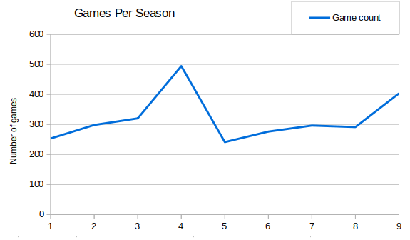
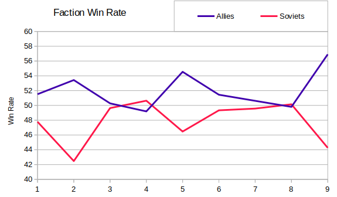
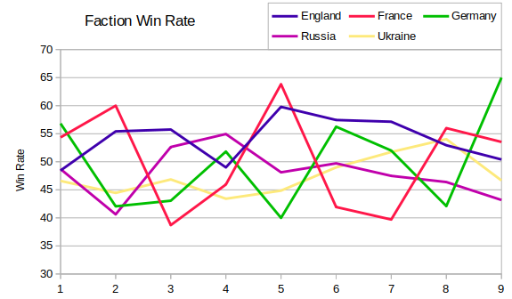

Jazz helpfully provided the replays from previous seasons of RAGL and so I was able to run some analysis of how the game was played each season.  Several of the replays seem to be corrupted, and a few other games have snuck in, but I was able to process the vast majority of games without trouble.  To give some idea of when each season was, here are the OpenRA releases that were used and the number of games parsed for each season:
```
S01: release-20151224, 253 games
S02: release-20161019, 298 games
S03:    --- " ---      320 games
S04: release-20170527, 494 games
S05: release-20180307, 241 games
S06: release-20180923, 276 games
S07: release-20190314, 296 games
S08:    --- " ---      291 games
S09: release-20200503, 403 games (nb. maps were modified with BAIN balance changes)
```



The most recent season of RAGL seemed to have a higher win rate for Allies rather than Soviets. It's already been suggested that this may be because many of the top players preferred Allies (rather than that picking Allies made them top players).  However I thought it would be interesting to see a comparison of the faction win rates stats by season.

```
SEASON 1
Faction        Win Rate       From Random A/S     Picked Win Rate
England       78/161 48%          2/  6 33%         64/140 46%
France        50/ 92 54%          5/  9 56%         31/ 59 53%
Germany       25/ 44 57%          5/  8 62%          7/ 11 64%
Allies       153/297 52%         12/ 23 52%            ---
Russia        41/ 88 47%          6/  8 75%         27/ 57 47%
Ukraine       56/115 49%          3/  9 33%         37/ 72 51%
Soviet        97/203 48%          9/ 17 53%            ---
Random        63/121 52%            ---                ---

SEASON 2
Faction        Win Rate       From Random A/S     Picked Win Rate
England       92/166 55%         10/ 18 56%         63/114 55%
France        81/135 60%         13/ 22 59%         53/ 88 60%
Germany       45/107 42%         11/ 19 58%         17/ 64 27%
Allies       218/408 53%         34/ 59 58%            ---
Russia        40/ 90 44%          4/ 10 40%         10/ 33 30%
Ukraine       39/ 96 41%          3/  6 50%         21/ 53 40%
Soviet        79/186 42%          7/ 16 44%            ---
Random        92/167 55%            ---                ---

SEASON 3
Faction        Win Rate       From Random A/S     Picked Win Rate
England      126/226 56%          8/ 18 44%        111/188 59%
France        24/ 62 39%          5/  7 71%          5/ 24 21%
Germany       31/ 72 43%          4/ 12 33%          7/ 15 47%
Allies       181/360 50%         17/ 37 46%            ---
Russia        67/143 47%          4/ 10 40%         33/ 87 38%
Ukraine       70/133 53%         10/ 23 43%         46/ 69 67%
Soviet       137/276 50%         14/ 33 42%            ---
Random        85/182 47%            ---                ---

SEASON 4
Faction        Win Rate       From Random A/S     Picked Win Rate
England      122/249 49%         15/ 21 71%         89/183 49%
France        34/ 74 46%         11/ 18 61%          1/ 14 7%
Germany       57/110 52%          8/ 18 44%         14/ 36 39%
Allies       213/433 49%         34/ 57 60%            ---
Russia        89/205 43%         15/ 27 56%         42/105 40%
Ukraine      189/344 55%         19/ 30 63%        133/245 54%
Soviet       278/549 51%         34/ 57 60%            ---
Random       144/285 51%            ---                ---

SEASON 5
Faction        Win Rate       From Random A/S     Picked Win Rate
England       58/ 97 60%          2/  3 67%         36/ 63 57%
France        30/ 47 64%          0/  1 0%          2/  4 50%
Germany       26/ 65 40%            ---             13/ 34 38%
Allies       114/209 55%          2/  4 50%            ---
Russia        61/136 45%         11/ 30 37%         31/ 64 48%
Ukraine       64/133 48%         13/ 29 45%         31/ 60 52%
Soviet       125/269 46%         24/ 59 41%            ---
Random       100/190 53%            ---                ---

SEASON 6
Faction        Win Rate       From Random A/S     Picked Win Rate
England       27/ 47 57%          2/  5 40%          6/  7 86%
France        26/ 62 42%          0/  3 0%          4/ 21 19%
Germany       36/ 64 56%          4/  4 100%         18/ 32 56%
Allies        89/173 51%          6/ 12 50%            ---
Russia        98/200 49%         14/ 33 42%         48/ 95 51%
Ukraine       88/177 50%         10/ 37 27%         41/ 73 56%
Soviet       186/377 49%         24/ 70 34%            ---
Random       128/240 53%            ---                ---

SEASON 7
Faction        Win Rate       From Random A/S     Picked Win Rate
England       56/ 98 57%          2/ 11 18%         33/ 57 58%
France        27/ 68 40%          4/ 11 36%         10/ 30 33%
Germany       39/ 75 52%          4/ 10 40%         27/ 40 68%
Allies       122/241 51%         10/ 32 31%            ---
Russia        89/172 52%         18/ 58 31%         49/ 77 64%
Ukraine       85/179 47%          8/ 38 21%         55/101 54%
Soviet       174/351 50%         26/ 96 27%            ---
Random        86/159 54%            ---                ---

SEASON 8
Faction        Win Rate       From Random A/S     Picked Win Rate
England       45/ 85 53%          3/  6 50%         15/ 31 48%
France        42/ 75 56%          4/  5 80%          7/ 20 35%
Germany       40/ 95 42%          1/  3 33%         18/ 52 35%
Allies       127/255 50%          8/ 14 57%            ---
Russia        87/161 54%         20/ 38 53%         31/ 61 51%
Ukraine       77/166 46%         14/ 40 35%         27/ 60 45%
Soviet       164/327 50%         34/ 78 44%            ---
Random       151/266 57%            ---                ---

SEASON 9
Faction        Win Rate       From Random A/S     Picked Win Rate
England       62/123 50%         16/ 25 64%         26/ 53 49%
France        53/ 99 54%         11/ 20 55%         18/ 27 67%
Germany       91/140 65%         13/ 21 62%         53/ 72 74%
Allies       206/362 57%         40/ 66 61%            ---
Russia        63/135 47%          7/ 23 30%         17/ 41 41%
Ukraine      130/301 43%          9/ 27 33%         89/214 42%
Soviet       193/436 44%         16/ 50 32%            ---
Random       140/275 51%            ---                ---
```

So almost every season has marginally favoured Allies over Soviets. Season 4 was the only exception with a 49%/51% split.  Season 9 has the biggest discrepancy between Allies and Soviet wins, although Season 5 came close with a 55% win rate for Allies.



Individual nations show less obvious winners and losers.



In the next post I plan to look at the popularity and effectiveness of buildings over the seasons.