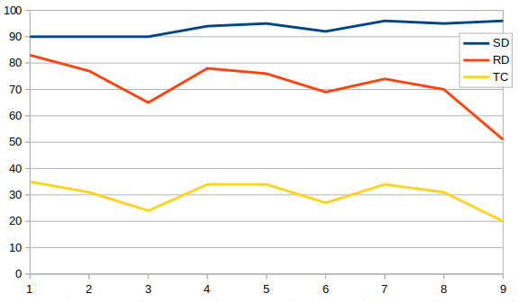
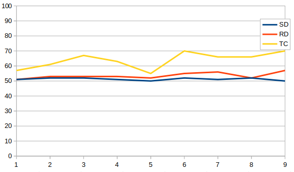

As promised, I've generated some stats about the first queue - buildings.

```
SEASON 1
Power Plant: 2444 (506 builds (100%), 50% wins)
Refinery: 2356 (504 builds (100%), 50% wins)
Barracks: 2044 (506 builds (100%), 50% wins)
Advanced Power Plant: 1477 (363 builds (72%), 52% wins)
War Factory: 897 (496 builds (98%), 50% wins)
Service Depot: 531 (454 builds (90%), 51% wins)
Radar Dome: 485 (421 builds (83%), 51% wins)
Helipad: 473 (236 builds (47%), 51% wins)
Airfield: 274 (150 builds (30%), 56% wins)
Tech Centre: 221 (179 builds (35%), 57% wins)
Kennel: 69 (67 builds (13%), 52% wins)
Sub Pen: 32 (19 builds (4%), 56% wins)
Naval Yard: 20 (15 builds (3%), 33% wins)

SEASON 2
Power Plant: 3400 (596 builds (100%), 50% wins)
Refinery: 2848 (596 builds (100%), 50% wins)
Barracks: 2822 (596 builds (100%), 50% wins)
Advanced Power Plant: 1160 (347 builds (58%), 55% wins)
War Factory: 822 (590 builds (99%), 50% wins)
Helipad: 724 (283 builds (47%), 57% wins)
Service Depot: 598 (534 builds (90%), 52% wins)
Radar Dome: 514 (457 builds (77%), 53% wins)
Tech Centre: 220 (185 builds (31%), 61% wins)
Airfield: 166 (102 builds (17%), 49% wins)
Naval Yard: 42 (26 builds (4%), 54% wins)
Kennel: 30 (27 builds (5%), 56% wins)
Sub Pen: 8 (4 builds (1%), 50% wins)

SEASON 3
Barracks: 4267 (637 builds (100%), 50% wins)
Power Plant: 3994 (638 builds (100%), 50% wins)
Refinery: 3506 (635 builds (99%), 50% wins)
Advanced Power Plant: 944 (320 builds (50%), 56% wins)
War Factory: 839 (627 builds (98%), 50% wins)
Service Depot: 645 (574 builds (90%), 52% wins)
Radar Dome: 470 (418 builds (65%), 53% wins)
Helipad: 460 (208 builds (32%), 54% wins)
Airfield: 236 (133 builds (21%), 53% wins)
Tech Centre: 170 (154 builds (24%), 67% wins)
Kennel: 97 (92 builds (14%), 48% wins)
Naval Yard: 6 (5 builds (1%), 60% wins)
Sub Pen: 1 (1 builds (0%), 0% wins)

SEASON 4
Barracks: 6254 (987 builds (100%), 50% wins)
Refinery: 5980 (985 builds (100%), 50% wins)
Power Plant: 5837 (987 builds (100%), 50% wins)
Advanced Power Plant: 2436 (640 builds (65%), 54% wins)
War Factory: 1420 (970 builds (98%), 51% wins)
Service Depot: 1067 (933 builds (94%), 51% wins)
Radar Dome: 923 (772 builds (78%), 53% wins)
Airfield: 716 (369 builds (37%), 57% wins)
Helipad: 682 (288 builds (29%), 54% wins)
Tech Centre: 404 (334 builds (34%), 63% wins)
Kennel: 98 (96 builds (10%), 59% wins)
Naval Yard: 5 (4 builds (0%), 50% wins)
Sub Pen: 2 (2 builds (0%), 50% wins)

SEASON 5
Refinery: 3454 (482 builds (100%), 50% wins)
Power Plant: 2860 (482 builds (100%), 50% wins)
Barracks: 2840 (482 builds (100%), 50% wins)
Advanced Power Plant: 1290 (313 builds (65%), 51% wins)
War Factory: 757 (472 builds (98%), 50% wins)
Service Depot: 512 (456 builds (95%), 50% wins)
Radar Dome: 424 (366 builds (76%), 52% wins)
Helipad: 389 (147 builds (30%), 56% wins)
Airfield: 272 (168 builds (35%), 50% wins)
Tech Centre: 194 (166 builds (34%), 55% wins)
Kennel: 32 (32 builds (7%), 52% wins)

SEASON 6
Refinery: 3895 (552 builds (100%), 50% wins)
Power Plant: 3758 (552 builds (100%), 50% wins)
Barracks: 3021 (552 builds (100%), 50% wins)
Advanced Power Plant: 1104 (311 builds (56%), 59% wins)
War Factory: 838 (540 builds (98%), 50% wins)
Service Depot: 586 (510 builds (92%), 52% wins)
Radar Dome: 440 (380 builds (69%), 55% wins)
Airfield: 340 (200 builds (36%), 57% wins)
Helipad: 259 (109 builds (20%), 61% wins)
Tech Centre: 170 (147 builds (27%), 70% wins)
Kennel: 69 (69 builds (12%), 45% wins)

SEASON 7
Refinery: 4000 (592 builds (100%), 50% wins)
Power Plant: 3690 (592 builds (100%), 50% wins)
Barracks: 2939 (592 builds (100%), 50% wins)
Advanced Power Plant: 1194 (327 builds (55%), 59% wins)
War Factory: 1032 (588 builds (99%), 50% wins)
Service Depot: 645 (571 builds (96%), 51% wins)
Radar Dome: 482 (436 builds (74%), 56% wins)
Airfield: 355 (206 builds (35%), 56% wins)
Helipad: 343 (144 builds (24%), 60% wins)
Tech Centre: 231 (204 builds (34%), 66% wins)
Kennel: 121 (121 builds (20%), 60% wins)

SEASON 8
Refinery: 4362 (579 builds (99%), 50% wins)
Power Plant: 4158 (582 builds (100%), 50% wins)
Barracks: 3259 (582 builds (100%), 50% wins)
Advanced Power Plant: 1145 (307 builds (53%), 58% wins)
War Factory: 1024 (574 builds (99%), 50% wins)
Service Depot: 649 (553 builds (95%), 52% wins)
Radar Dome: 456 (407 builds (70%), 52% wins)
Airfield: 345 (177 builds (30%), 59% wins)
Helipad: 326 (141 builds (24%), 54% wins)
Tech Centre: 218 (183 builds (31%), 66% wins)
Kennel: 75 (75 builds (13%), 55% wins)
Naval Yard: 8 (2 builds (0%), 50% wins)

SEASON 9
Power Plant: 5604 (806 builds (100%), 50% wins)
Refinery: 5419 (806 builds (100%), 50% wins)
Barracks: 5024 (805 builds (100%), 50% wins)
War Factory: 1348 (796 builds (99%), 50% wins)
Service Depot: 948 (775 builds (96%), 50% wins)
Advanced Power Plant: 759 (283 builds (35%), 65% wins)
Radar Dome: 436 (409 builds (51%), 57% wins)
Airfield: 283 (178 builds (22%), 58% wins)
Helipad: 235 (126 builds (16%), 69% wins)
Tech Centre: 185 (158 builds (20%), 70% wins)
Kennel: 127 (127 builds (16%), 50% wins)
Sub Pen: 1 (1 builds (0%), 0% wins)
```

Topping the list every season are Power Plants, Refs and Barracks. These are the first buildings placed and each player needs several to get infantry production up to full speed. Barracks and PPs are also useful for base pushes.  Note that there are minor discrepancies in the number of builds containing each of these buildings which is due to games that were abandoned at the start, but uploaded to Jazz's archive anyway.

The fourth spot has historically gone to the Advanced Power Plant, but in S09 there was a huge drop in popularity.  Perhaps surprisingly the Radar Dome is consistently seen in about 15-20% more builds than the Advanced Power Plant. Possibly players continue to use the standard PP, or perhaps because building a Radar Dome is often done near the end of the game.

Tech buildings have had a noticeable change in popularity. Service Depot builds have crept from 90% of all builds in Season 1 to 96% in Season 9. Meanwhile radar domes have had a dramatic fall from grace. In Season 1 they were part of the standard build, whereas in Season 9 many games end without one.  The Tech Centre has hovered around the 30% mark, but in Season 9 they hit an all time low of 20%.



Conversely, looking at the win rates for these three buildings, we can see that the Service Depot and Radar Dome are basically at 50% win and loss (due to their pervasiveness).  Tech Centres correlate with winning the game - although as always it's hard to identify cause and effect.



Finally I thought it was worth having a look at Naval.  Naval Yards and Sub Pens were seen in about 3-4% of builds in Seasons 1 and 2, but for Seasons 5, 6 and 7 they weren't seen at all.  I didn't check, but I expect this is predominantly due to the maps not having suitable spots. Season 9 featured two maps supporting naval play, and still only Mo attempted to make use of it.  Hopefully by Season 10 we'll have naval balance sorted out ;-)
