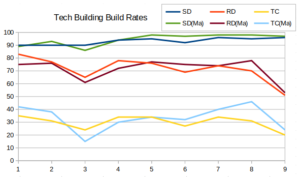
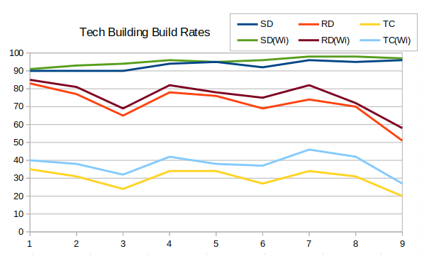

There was a request to compare just games from Masters over the seasons. This graph shows Service Depot, Radar Dome and Tech Centre usage (queuing) over the different seasons of RAGL.

Another request was to compare how often the tech buildings were made by winning players. Here we can see that winners consistently built tech buildings slightly more often.

