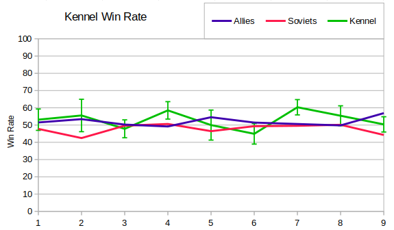

There are two more observations I wanted to make about the building queue results and then I'll start on the defences queue.

First I wanted to talk about kennels.  When I started playing then I thought dogs were a joke unit and only became good recently.  The sample sets are very small for this as kennels can only be build by Soviets and aren't much use after the early game.  For this reason I decided to include error bars on the graph (showing standard error for binary variables).  I didn't add error bars for the Allies or Soviet lines since these would be much smaller, and cluttered the graph.  Even taking the error bars into account then it seems that dogs have always been a decent investment for Soviets (at least on some maps). There was some concern about Allies winning far more games than Soviets in S09, but perhaps this is somewhat countered by Soviets with dogs winning 50% of their games.



The other investigation I wanted to do here was into the small percentage of War Factory-less builds.  Looking at the popular builds we can see that a major component of these are triple-ref all-ins.  Here are all the build orders that excluded the WF and appeared three or more times in a season, along with how often WF was omitted and the win rates. For example "3 [PP][Rx][Rf][PP]" means that three build orders started with PP, Rax, Ref, PP in that season.

```
Season 1 Build rate:  2% Win Rate:  7/12 (58%)
3 [PP][Rx][Rf][PP]
3  ..  ..  .. [Rx][PP]
Season 2 Build rate:  2% Win Rate:  6/ 9 (67%)
4 [PP][Rx][Rf][Rf]
3  ..  ..  .. [Rx][PP]
Season 3 Build rate:  2% Win Rate:  2/11 (18%)
3 [PP][Rx][Rf][Rf][PP][Rf][Rx][Rx][Rx]
Season 4 Build rate:  2% Win Rate:  5/18 (28%)
3 [PP][Rf][Rx]
6  .. [Rx][Rf][Rf][PP][Rx]
Season 5 Build rate:  2% Win Rate:  5/12 (42%)
3 [PP][Rx][Rf][Rf][Rf][PP]
Season 6 Build rate:  4% Win Rate:  7/22 (32%)
4 [PP][Rx][Rf][PP]
4  ..  ..  .. [Rf][PP][Rf][Rx][Rx][PP][Rx]
Season 7 Build rate:  1% Win Rate:  2/ 7 (29%)
3 [PP][Rx][Rf][Rf][PP][Rf][Rx][Rx][PP]
Season 8 Build rate:  1% Win Rate:  5/ 8 (62%)
3 [PP][Rx][Rf][Rf][Rx]
Season 9 Build rate:  2% Win Rate: 10/20 (50%)
3 [PP][Rx][Rf][Rf][PP][Rf][Rx][Rx][PP][Rx][PP]
4  ..  ..  ..  ..  .. [Rx]
```

The error for these results is event larger than for kennels, but it does seem that it has been a reasonably good cheese build since about Season 3.  Some of these build orders seem unviable to me, but possibly they involve a sell order too, which I haven't captured.  Restricting just to those builds that had at least three refs and no WF, then the count is low enough to simply list them all.  A few familiar names appear in the list, and in Season 9 Duke Bones claiming the title of king of the triple-ref all-ins!

```
SEASON 1
Flecken          [PP][Rx][Rf][Rf][PP][Rx][Rx][Rf][Rf][PP] (Ore Lord)
SEASON 2
MicroBit         [PP][Rx][Rf][Rf][Rf][Rx][PP][PP][PP][PP][PP][PP][PP][PP][PP] (Ore Lord)
anjew            [PP][Rx][Rf][Rf][Rx][Rf] (Keep Off The Grass 2)
SEASON 3
t                [PP][Rx][Rf][Rf][PP][Rx][Rf][Rx][Rx][PP][Rx] (Agenda (RAGL:S3))
Barf             [PP][Rx][Rf][Rx][PP][Rf][PP][Rx][Rf][PP][RD][HP][HP][HP][Rf][PP][Rx][Rx][PP][PP][Rx][Rx][Rf][PP][Rx][Rx] (Patches (RAGL:S3))
WhoCares         [PP][Rx][Rf][Rf][PP][Rf][Rx][Rx][Rx][Rx][PP][Rx][PP][Rx][Rx][Rx][Rx][Rx][Rx][Rx][Rx][Rx] (Agenda (RAGL:S3))
mechANIC         [PP][Rx][Rf][Rf][Rx][PP][Rf][PP][Rx] (Behind The Veil 2 (RAGL:S3))
WhoCares         [PP][Rx][Rf][Rf][PP][Rf][Rx][Rx][Rx][PP][PP] (Pitfight (RAGL:S3))
t                [PP][Rx][Rf][Rf][PP][Rf][Rx][Rx][Rx][PP][Rx][Rx][Rx][PP][Rx][Rx][Rx] (Pitfight (RAGL:S3))
WhoCares         [PP][Rx][Rf][Rf][PP][Rx][PP][Rf][Rf][Rx][Rx][Rx][PP][PP][Rx] (Keep Off The Grass 2 (RAGL:S3))
Doomsday         [PP][Rx][Rf][Rf][Rf][PP][Rx][Rx][Ke][Rx][PP][Rx][Rx][Rx] (Northwest Passage (RAGL:S3))
SEASON 4
Han              [PP][Rx][Rf][Rf][PP][Rx][Rf][PP][Rx][Rx][Rx] (A Nuclear Winter (RAGL:S4))
Gatekeeper       [PP][Rf][Rx][Rf][Rx][Rf][PP][Rf][PP][Rx][Rf][PP] (Ysmir (RAGL:S4))
Digital Jihad    [PP][Rx][Rf][Rf][PP][Rf][Rf][Rx][Rx][PP][Rx][Rx][Rx][Rx][PP][Rx][Rx] (Pitfight (RAGL:S4))
Digital Jihad    [PP][Rx][Rf][Rf][PP][Rf][Rx][Rx] (Keep Off The Grass 2 (RAGL:S4))
abcdefg30        [PP][Rf][Rx][Rf][Rx][PP][Rx][PP][Rf][Rx][Rx][Rx] (Behind the Veil (RAGL:S4))
Blackened        [PP][Rx][Rf][Rf][PP][Rx][PP][Rf][Rf][PP][PP][Rx][PP][PP][PP] (Borrowed Time (RAGL:S4))
SEASON 5
Digital Jihad    [PP][Rx][Rf][Rf][Rf][PP][Rx][Rx][Rx] (River of Gold (RAGL:S5))
spetsnaz84       [PP][Rx][Rf][Rf][Rf][PP][PP] (Stanitsa (RAGL:S5))
bµg              [PP][Rx][Rf][Rf][PP][Rf][Rx][Rx][PP][Rx][PP][Rx][PP][Rx] (Trapped (RAGL:S5))
Anykeyich        [PP][Rx][Rf][Rf][Rf][Ke][Rx][Rx] (Stanitsa (RAGL:S5))
Digital Jihad    [PP][Rx][Rf][Rf][Rf][PP][Rx][Rx][Rx][Rx][PP] (River of Gold (RAGL:S5))
Unano            [PP][Rx][Rf][Rf][PP][PP][Rf][PP][Rx][Rx][PP][Rx][PP] (Race Tracks (RAGL:S5))
SEASON 6
Dualwarhead      [PP][Rx][Rf][Rf][PP][Rf][Rx][PP][Rx][Rx][PP] (Shared Responsibility r2 (RAGL:S6))
merimursu        [PP][Rx][Rf][Rf][PP][Rf][PP][Rx] (Shared Responsibility r2 (RAGL:S6))
beuk             [PP][Rx][Rf][Rf][PP][Rf][Rx][Rx][PP][Rx] (Snakes and Ladders (RAGL:S6))
Upps             [PP][Rx][Rf][Rf][PP][Rf][Rx][Rx][PP][Rx] (Oil Sands (RAGL:S6))
lundizTV         [PP][Rx][Rf][Rf][PP][Rf][Rx][Rx][PP][Rx][Rx] (Map X (RAGL:S6))
beuk             [PP][Rx][Rf][Rf][PP][Rf][Rx][Rx][PP][Rx][Rx][Rx][PP][Rx] (Snakes and Ladders (RAGL:S6))
WhoCares!?       [PP][Rx][Rf][PP][Rf][PP][Rx][PP][Rf][Rx] (Shared Responsibility (RAGL:S6))
beuk             [PP][Rx][Rf][Rf][PP][Rf][Rx][Rx][PP] (Snakes and Ladders (RAGL:S6))
WhoCares!?       [PP][Rx][Rf][Rf][PP][PP][Rf][Rx][Rx][Rx][Rx][PP][Rx] (Uzala (RAGL:S6))
SirCakealot      [PP][Rx][Ke][Rf][Rf][PP][RD][AF][Rf][AP] (Snakes and Ladders (RAGL:S6))
SEASON 7
Fruttielicious   [PP][Rf][Rf][Rx][PP][Rf] (Aqueducts (RAGL:S7))
jjkramok         [PP][Rx][Rf][Rf][PP][Rf][Rx][Rx][PP][PP][Rx][PP][Rx][PP][Rx][PP] (Agenda (RAGL:S7))
jjkramok         [PP][Rx][Rf][Rf][PP][Rf][Rx][Rx][PP][PP][Rx] (Map X (RAGL:S7))
SirCakealot      [PP][Rx][Rf][Rf][RD][PP][HP][HP][Rf][Rx][Rx][Rx][PP][PP][PP][PP][PP][Rx][Rx][Rx][Rx] (Pitfight (RAGL:S7))
mechANIC         [PP][Rx][Rf][Rf][PP][Rf] (Lacetown (RAGL:S7))
Malboo           [PP][Rx][Rf][Rf][PP][Rf][Rx][Rx][PP] (Map X (RAGL:S7))
Jur              [PP][Rx][Rf][Rf][PP][Rx][Rf] (Hourglass (RAGL:S7))
SEASON 8
Dualwarhead      [PP][Rx][Rf][Rf][Rf][PP] (Mountain Ridge Redux (RAGL:S8))
PieChild         [PP][Rx][Rf][Rf][PP][Rx][Rf][Rf] (Mountain Ridge Redux (RAGL:S8))
DoDoCat          [PP][Rx][Rf][Rf][Rx][PP][Rf][PP][Rf][PP][PP][PP] (Climate Crisis (RAGL:S8))
SEASON 9
WhoCares         [PP][Rx][Rf][Rf][PP][Rf][Rx][PP][Rx][Rx][PP][Rf][Rf][PP] (Sonora RAGL S9)
Duke Bones       [PP][Rx][Rf][Rf][PP][Rf][Rx][Rx][PP][Rx][PP][Rx][Rx][PP] (Ore Egano RAGL S9)
Zaqzorn          [PP][Rx][Rf][Rf][PP][Rx][Rx][PP][Rx][Rx][Rx][Rf][Rf][PP] (Ore Egano RAGL S9)
Duke Bones       [PP][Rx][Rf][Rf][PP][Rf][Rx][Rx][PP][Rx] (The Swamp RAGL S9)
Duke Bones       [PP][Rx][Rf][Rf][PP][Rf][Rx][Rx][PP][Rx][Rx][PP][Rx] (Ore Egano RAGL S9)
Zaqzorn          [PP][Rx][Rf][Rf][Rf][PP][Rx][Rx][Rx][Rf][Rf][Rf][PP][PP][Rf] (Shadowfiend II RAGL S9)
Duke Bones       [PP][Rx][Rf][Rf][PP][Rf][Rx][Rx][PP][Rx][PP][Rf][Rf][PP][PP][Rx][Rx][PP] (Dual Cold Front RAGL S9)
Duke Bones       [PP][Rx][Rf][Rf][PP][Rx][Rf][Rx][PP][Rx] (Shadowfiend II RAGL S9)
Duke Bones       [PP][Rx][Rf][Rf][PP][Rf][Rx][Rx][PP][Rx][PP][Rf][Rf][PP][PP][Rx][Rx][PP] (Dual Cold Front RAGL S9)
```

Also, in case you were wondering (as I was) why the WF-less build rate does not seem to agree with the WF stats in [the previous post](002_buildings.md), the reason is quite simple. The stats in the earlier post are for buildings queued, whereas this post looked at buildings placed.  There are a few games where the WF was queued but not placed.
