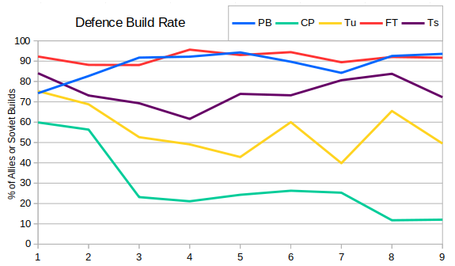
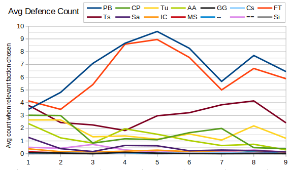
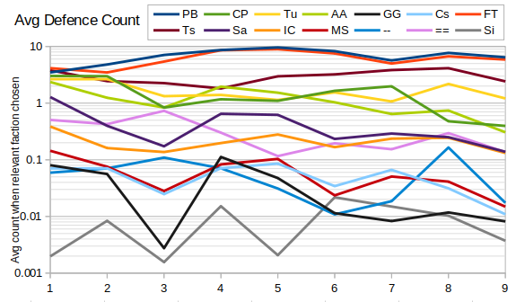

Onto the defences queue!  It's always good to start with a wall of text, so here's the item count, queue count and win rate for defences broken down by season.

```
SEASON 1
Pillbox: 1185 (230 builds (45%), 48% wins)
Camo Pillbox: 1034 (183 builds (36%), 53% wins)
Flame Tower: 1016 (194 builds (38%), 47% wins)
Turret: 999 (237 builds (47%), 51% wins)
Teslacoil: 902 (179 builds (35%), 50% wins)
AA Gun: 773 (197 builds (39%), 49% wins)
SAM Site: 287 (82 builds (16%), 51% wins)
Concrete Wall: 264 (51 builds (10%), 46% wins)
Iron Curtain: 87 (72 builds (14%), 64% wins)
Missile Silo: 86 (75 builds (15%), 75% wins)
Fence: 36 (12 builds (2%), 58% wins)
Gap Generator: 28 (12 builds (2%), 58% wins)
Chronosphere: 22 (22 builds (4%), 36% wins)
Fake Radar Dome: 13 (13 builds (3%), 23% wins)
Fake Tech Center: 13 (9 builds (2%), 22% wins)
Fake Missile Silo: 9 (8 builds (2%), 38% wins)
Fake War Factory: 7 (7 builds (1%), 50% wins)
Fake Power Plant: 6 (6 builds (1%), 0% wins)
Fake Conyard: 4 (3 builds (1%), 33% wins)
Fake Advance Power: 3 (2 builds (0%), 0% wins)
Fake Chronosphere: 2 (2 builds (0%), 0% wins)
Silo: 1 (1 builds (0%), 0% wins)

SEASON 2
Pillbox: 2397 (342 builds (57%), 55% wins)
Camo Pillbox: 1450 (242 builds (41%), 56% wins)
Turret: 1430 (302 builds (51%), 55% wins)
Flame Tower: 743 (167 builds (28%), 40% wins)
AA Gun: 578 (181 builds (30%), 53% wins)
Teslacoil: 571 (150 builds (25%), 46% wins)
Concrete Wall: 262 (67 builds (11%), 54% wins)
SAM Site: 83 (41 builds (7%), 44% wins)
Missile Silo: 55 (51 builds (9%), 66% wins)
Fence: 50 (20 builds (3%), 50% wins)
Iron Curtain: 37 (37 builds (6%), 62% wins)
Fake Conyard: 33 (20 builds (3%), 80% wins)
Chronosphere: 32 (32 builds (5%), 69% wins)
Fake Power Plant: 29 (16 builds (3%), 56% wins)
Gap Generator: 26 (18 builds (3%), 89% wins)
Fake War Factory: 19 (12 builds (2%), 50% wins)
Fake Radar Dome: 10 (8 builds (1%), 50% wins)
Fake Tech Center: 6 (5 builds (1%), 100% wins)
Silo: 6 (5 builds (1%), 20% wins)
Fake Missile Silo: 6 (4 builds (1%), 100% wins)
Fake Chronosphere: 2 (1 builds (0%), 100% wins)
Fake Service Depot: 1 (1 builds (0%), 0% wins)

SEASON 3
Pillbox: 3860 (340 builds (53%), 51% wins)
Flame Tower: 2261 (254 builds (40%), 48% wins)
Teslacoil: 837 (205 builds (32%), 52% wins)
Turret: 612 (206 builds (32%), 51% wins)
Concrete Wall: 503 (123 builds (19%), 44% wins)
Camo Pillbox: 412 (91 builds (14%), 37% wins)
AA Gun: 357 (123 builds (19%), 48% wins)
Fence: 75 (27 builds (4%), 52% wins)
Iron Curtain: 50 (43 builds (7%), 77% wins)
SAM Site: 49 (27 builds (4%), 41% wins)
Missile Silo: 27 (26 builds (4%), 81% wins)
Chronosphere: 11 (11 builds (2%), 73% wins)
Fake Power Plant: 3 (1 builds (0%), 100% wins)
Gap Generator: 3 (2 builds (0%), 100% wins)
Fake Conyard: 3 (3 builds (0%), 33% wins)
Silo: 2 (2 builds (0%), 50% wins)
Fake War Factory: 1 (1 builds (0%), 100% wins)

SEASON 4
Pillbox: 7963 (405 builds (41%), 50% wins)
Flame Tower: 6598 (536 builds (54%), 51% wins)
Teslacoil: 1270 (366 builds (37%), 52% wins)
AA Gun: 960 (220 builds (22%), 46% wins)
Turret: 758 (231 builds (23%), 49% wins)
Camo Pillbox: 658 (101 builds (10%), 43% wins)
SAM Site: 404 (138 builds (14%), 49% wins)
Concrete Wall: 319 (96 builds (10%), 57% wins)
Iron Curtain: 141 (114 builds (12%), 68% wins)
Missile Silo: 107 (92 builds (9%), 70% wins)
Fence: 85 (31 builds (3%), 42% wins)
Gap Generator: 58 (26 builds (3%), 58% wins)
Chronosphere: 40 (38 builds (4%), 66% wins)
Silo: 15 (6 builds (1%), 0% wins)
Fake Power Plant: 7 (4 builds (0%), 100% wins)
Fake War Factory: 1 (1 builds (0%), 100% wins)
Fake Missile Silo: 1 (1 builds (0%), 0% wins)
Fake Advance Power: 1 (1 builds (0%), 100% wins)
Fake Radar Dome: 1 (1 builds (0%), 0% wins)
Fake Conyard: 1 (1 builds (0%), 0% wins)

SEASON 5
Flame Tower: 3197 (257 builds (53%), 46% wins)
Pillbox: 2643 (200 builds (41%), 55% wins)
Teslacoil: 1034 (208 builds (43%), 48% wins)
AA Gun: 373 (99 builds (21%), 48% wins)
Camo Pillbox: 338 (54 builds (11%), 51% wins)
Turret: 309 (94 builds (20%), 51% wins)
SAM Site: 187 (61 builds (13%), 44% wins)
Iron Curtain: 86 (72 builds (15%), 60% wins)
Missile Silo: 68 (58 builds (12%), 67% wins)
Concrete Wall: 56 (23 builds (5%), 43% wins)
Chronosphere: 19 (17 builds (4%), 59% wins)
Fence: 16 (10 builds (2%), 30% wins)
Gap Generator: 14 (8 builds (2%), 88% wins)
Fake Power Plant: 13 (6 builds (1%), 67% wins)
Fake Tech Center: 6 (2 builds (0%), 0% wins)
Silo: 3 (3 builds (1%), 67% wins)
Fake Radar Dome: 1 (1 builds (0%), 0% wins)
Fake War Factory: 1 (1 builds (0%), 0% wins)
Fake Conyard: 1 (1 builds (0%), 100% wins)

SEASON 6
Flame Tower: 3806 (362 builds (66%), 49% wins)
Pillbox: 2179 (161 builds (29%), 53% wins)
Teslacoil: 1560 (288 builds (52%), 51% wins)
Turret: 331 (111 builds (20%), 49% wins)
Camo Pillbox: 318 (47 builds (9%), 55% wins)
AA Gun: 209 (61 builds (11%), 43% wins)
Concrete Wall: 122 (40 builds (7%), 52% wins)
SAM Site: 115 (57 builds (10%), 47% wins)
Iron Curtain: 85 (77 builds (14%), 71% wins)
Missile Silo: 17 (17 builds (3%), 76% wins)
Fake Power Plant: 13 (9 builds (2%), 56% wins)
Silo: 13 (9 builds (2%), 44% wins)
Fence: 11 (6 builds (1%), 50% wins)
Chronosphere: 8 (7 builds (1%), 57% wins)
Gap Generator: 2 (1 builds (0%), 100% wins)
Fake Radar Dome: 1 (1 builds (0%), 0% wins)

SEASON 7
Pillbox: 3308 (207 builds (35%), 49% wins)
Flame Tower: 2298 (319 builds (54%), 49% wins)
Teslacoil: 1872 (293 builds (49%), 53% wins)
Camo Pillbox: 602 (65 builds (11%), 65% wins)
Turret: 417 (106 builds (18%), 55% wins)
AA Gun: 193 (69 builds (12%), 52% wins)
SAM Site: 128 (65 builds (11%), 55% wins)
Iron Curtain: 112 (94 builds (16%), 66% wins)
Concrete Wall: 96 (38 builds (6%), 58% wins)
Missile Silo: 48 (43 builds (7%), 84% wins)
Fake Power Plant: 25 (11 builds (2%), 55% wins)
Chronosphere: 19 (19 builds (3%), 79% wins)
Fence: 13 (7 builds (1%), 86% wins)
Fake War Factory: 10 (6 builds (1%), 50% wins)
Fake Service Depot: 5 (4 builds (1%), 50% wins)
Fake Radar Dome: 5 (5 builds (1%), 40% wins)
Gap Generator: 3 (3 builds (1%), 100% wins)
Fake Advance Power: 3 (1 builds (0%), 100% wins)
Fake Conyard: 1 (1 builds (0%), 0% wins)
Fake Missile Silo: 1 (1 builds (0%), 100% wins)

SEASON 8
Flame Tower: 2856 (308 builds (53%), 50% wins)
Pillbox: 2740 (241 builds (41%), 51% wins)
Teslacoil: 1925 (288 builds (49%), 50% wins)
Turret: 637 (174 builds (30%), 52% wins)
AA Gun: 245 (77 builds (13%), 48% wins)
Concrete Wall: 191 (46 builds (8%), 43% wins)
Camo Pillbox: 159 (31 builds (5%), 42% wins)
Fence: 113 (29 builds (5%), 34% wins)
SAM Site: 107 (45 builds (8%), 44% wins)
Iron Curtain: 97 (82 builds (14%), 71% wins)
Missile Silo: 39 (36 builds (6%), 78% wins)
Fake Power Plant: 29 (13 builds (2%), 69% wins)
Chronosphere: 11 (11 builds (2%), 82% wins)
Silo: 7 (4 builds (1%), 0% wins)
Gap Generator: 4 (4 builds (1%), 50% wins)
Fake Barracks: 3 (2 builds (0%), 0% wins)
Fake War Factory: 2 (2 builds (0%), 50% wins)
Fake Service Depot: 1 (1 builds (0%), 100% wins)

SEASON 9
Pillbox: 4597 (351 builds (44%), 57% wins)
Flame Tower: 3395 (409 builds (51%), 43% wins)
Teslacoil: 1890 (344 builds (43%), 49% wins)
Turret: 593 (198 builds (25%), 61% wins)
Camo Pillbox: 251 (54 builds (7%), 52% wins)
AA Gun: 146 (43 builds (5%), 55% wins)
Concrete Wall: 116 (29 builds (4%), 48% wins)
SAM Site: 70 (31 builds (4%), 47% wins)
Fake Power Plant: 70 (22 builds (3%), 52% wins)
Iron Curtain: 69 (64 builds (8%), 73% wins)
Fence: 25 (8 builds (1%), 50% wins)
Missile Silo: 20 (18 builds (2%), 61% wins)
Fake Barracks: 8 (5 builds (1%), 50% wins)
Chronosphere: 6 (6 builds (1%), 67% wins)
Fake War Factory: 6 (5 builds (1%), 60% wins)
Fake Service Depot: 3 (2 builds (0%), 50% wins)
Gap Generator: 3 (2 builds (0%), 100% wins)
Silo: 3 (3 builds (0%), 33% wins)
Fake Conyard: 3 (1 builds (0%), 0% wins)
Fake Radar Dome: 1 (1 builds (0%), 0% wins)
```

One thing that immediately stands out is that Pillboxes and Flame Towers are how people are filling their queues.  Seasons 1 and 2 have a very high number of Camo Pillboxes too, but from Season 3 onwards then the meta becomes Pillboxes for Allies and Flame Towers with a sprinkling of Teslacoils for Soviets.

Some of these stats are a little hard to compare, since Allies and Soviets weren't picked evenly, so next I wanted to look at how often the main ground defences appear in Allied/Soviet builds:



This graph says that e.g. at least one pillbox was built by ~94% of Allied players in Season 9.  I think this graph shows the impact of the Tesla nerf in S09, with a noticeable number of Soviet players forgoing Teslacoils completely.  It also highlights the decline of the Camo Pillbox, and shows that even in Seasons 1 and 2, when they were the second most popular defence, they were only built by a relatively small number of players.  This brings us nicely onto the topic of spamming.

It's often been mentioned that Pillbox spam used to be all the rage and to investigate this I calculated the average number of each defence *placed* (not queued as in the data above) per player that was the right faction.  So for example this is the total Pillboxes placed divided by the number of times Allies was played, but the total number of Missile Silos is divided by the total players, regardless of faction.  For Concrete Walls ("==") and Sandbag/Fences ("--") I've just counted each click as one placement, although it may cause several tiles to be filled.



So Pillbox spam was at its worst in Season 5, with an average of 9.5 Pillboxes placed each game per Allied player!  We can also see that the diversity of defences has dropped, possibly due to players learning the relative values of different defences, but possibly due to changes in balance.  One obvious example is that AA Gun usage dropped pretty much in line with Radar Domes.  The bottom of the graph is quite hard to read, so here's the same data on a logarithmic scale:



We can group the defences by popularity (or "spammability"). The top six (Pillbox, Flame Tower, Tesla Coil, Turret, Camo Pillbox, AA Gun) are all built an average of once every 3 builds or more. Below that we have SAM Site, Iron Curtain and Concrete Walls, which are rare, but certainly not unseen. Next we have the other tech defences - Missile Silo, Chronosphere, Gap Generator and Sandbags/Fences. Finally we have the Silo (which wasn't actually built in Season 7 - there's a mistake in the graph due to the log-scaling).

We can see that SAM Sites are much less popular than AA Guns, due in part to being less performant, but also because Soviets are able to make better use of Flaks.

One final observation here - the Iron Curtain is vastly more popular than the Chronosphere or Missile Silo.  For example in S09 then Chonospheres were built once for every 100 (Allied) players, Missile Silos once for every 67 players and Iron Curtains once for every 7 (Soviet) players.
