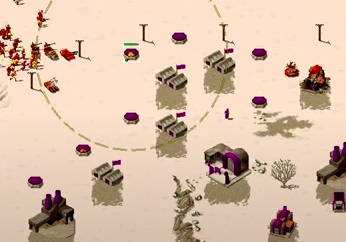
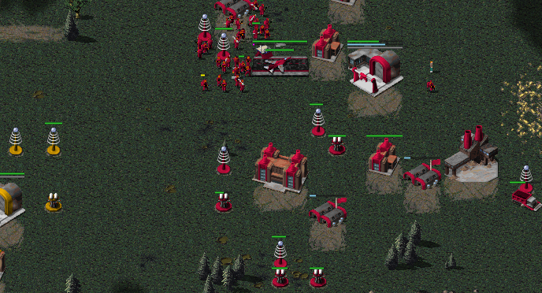

So having looked at defence spamming in the previous post I thought it would be interesting to look at the record holders for placing the most defences in a single game.  Again here I have used "==" for Concrete Walls and "--" for Sandbags and Fences, and I just counted the number of clicks - not the number of tiles covered by the wall/fence/sandbags.

```
PB 49 Happyyy RAGL-S03-Happy vs Juicebox POTH Game 3.orarep
CP 49 Barf RAGL-S02-MASTER-R02-ABC-BRF.orarep
Tu 33 Иαιgεl RAGL-S02-RECRUIT-R01-SMT-NAI.orarep
AA 27 3. Lucian RAGL-S04-RECRUIT-R04-LCN-MCV.ORAREP
GG 7 GoldenHippo RAGL-S01-RECRUIT-R08-GOH-DAZ..orarep
Cs 2 SeaCucumber RAGL-S04-RECRUIT-R06-SCR-DRG.orarep
FT 64 Testosterone Rex RAGL-S01-MINION-R09-TRX-ABC.orarep
Ts 37 Admiral mo RAGL-S08-MASTER-GROUP-BUG-AMO-G2.orarep
Sa 19 Testosterone Rex RAGL-S01-MINION-R09-TRX-ABC.orarep
IC 3 Testosterone Rex RAGL-S01-MINION-R09-TRX-ABC.orarep
MS 4 abcdefg30 RAGL-S01-MINION-R09-TRX-ABC.orarep
-- 9 Bo RAGL-S04-RECRUITC-R02-ANY-GBI.orarep
== 46 Barf RAGL-S01-MASTER-R04-DEC-BRF.orarep
Si 6 Бо RAGL-S04-RECRUITC-R07-GBI-WIP.orarep
```

Most of these records are due to the games being long, and probably because the game involves a lot of defences being destroyed and replaced.  For the superweapons then these also represent the record for number of snipes by the opponent.

Several of the Soviet records are held by Testosterone Rex in RAGL-S01-MINION-R09-TRX-ABC.orarep and Barf's 46-section wall in RAGL-S01-MASTER-R04-DEC-BRF.orarep sounds great. Unfortunately I don't have the client for Season 1 to grab a screenshot.

Happy claims the title of King of the Pillboxes which was during the "Hidden Path to Masters" for Season 3.  FiveAces has casted this series, and if you've not seen it then I recommend starting from game one. The game in question is the 3rd in the series and can be viewed [here](https://www.youtube.com/watch?v=-L8KupXZ3DY).



The most recent game that appears above is Admiral Mo vs Bug, which is a Soviet mirror match and features 54 Teslas in total. This screenshot makes it look like a stalemate, but it's actually a great game to watch. Sadly I couldn't find a cast of it.



Finally, I know some people are only interested in Masters games, so I ran the same queries against just those games. Obviously Mo and Barf still appear, but Happy's record is omitted because it was technically outside Masters:

```
PB 37 Brutal Al RAGL-S06-MASTERS-R04-FIV-ESK-G2.orarep
CP 49 Barf RAGL-S02-MASTER-R02-ABC-BRF.orarep
Tu 15 Klaas RAGL-S02-MASTER-R06-ANJ-KLA.orarep
AA 21 Brutal Al RAGL-S06-MASTERS-R04-FIV-ESK-G2.orarep
GG 2 Unano RAGL-S06-MASTER-R03-UPS-UNO-G2.orarep
Cs 2 Unano RAGL-S06-MASTER-R03-UPS-UNO-G2.orarep
FT 46 FiveAces RAGL-S04-MASTER-R08-SMT-FIV.orarep
Ts 37 Admiral mo RAGL-S08-MASTER-GROUP-BUG-AMO-G2.orarep
Sa 14 Declan RAGL-S01-MASTER-R04-DEC-BRF.orarep
IC 3 Klaas RAGL-S01-MASTER-R10-FIV-KLA.orarep
MS 3 Barf RAGL-S02-MASTER-R02-ABC-BRF.orarep
-- 8 anjew RAGL-S03-MASTER-R10-ABC-ANJ.orarep
== 46 Barf RAGL-S01-MASTER-R04-DEC-BRF.orarep
Si 2 abcdefg30 RAGL-S04-MASTER-R06-ABC-SMT.orarep
```
