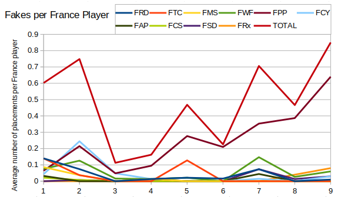
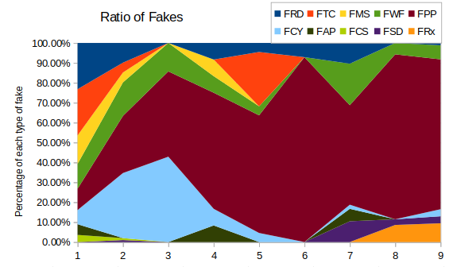
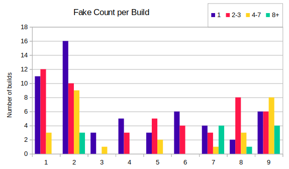

Continuing this exploration on the defence queue, we get to fakes.  It's hard to get accurate estimates of how good fakes are, since they're only available with one faction and historically France has been the least played (only 12% of all factions).  Probably one of the biggest boosts for using fakes was around Season 6 when the Phase Transport was moved from England to France.  The same release also contained fake chaining.

First let's look at the average number of fakes each France player builds.

It might be a bit tricky to work out what all the lines represent, but as a pointer then the first "F" stands for "Fake".  The important line is the top one which shows the average number of fakes French players built.  We can see that fakes have been making a resurgence, and this is mainly attributable to the Fake Power Plant.  Here's another graph showing the diversity of fakes built:

In Season 1 then fakes seem to have been used fairly randomly,  whereas now the main fakes used are Fake Power Plants and Fake Raxs (what's the right word for barracks-es?) presumably to protect against rushes, and fake WFs (maybe to protect against snipes, or maybe just for tanking?)  Note that the Fake Rax was only introduced in Season 8.  The Fake Service Depot was introduced in Season 2, but surprisingly seems to have been all but undiscovered until Season 7.

So now we've covered which fakes to build, but we still need to know how many.  The next graph looks at how common it is to build just one fake vs two or three vs four-seven vs eight or more.  In Season 8 then two or three Fake Power Plants was sufficient, but in Season 9 that doesn't seem to be sufficient, with players using a wall of fakes for scouting purposes.  (The ability to do this was available from Season 6, but the first I saw it used was by Morkel in Season 9).

After all of these stats then it's probably the right time to ask if we can tell whether building fakes actually serves any purpose.  I don't seem to be able to add four images to a post, so I'll put the results next time.