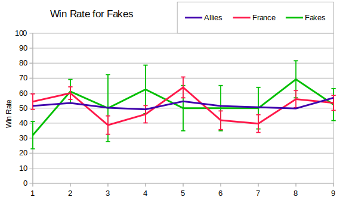
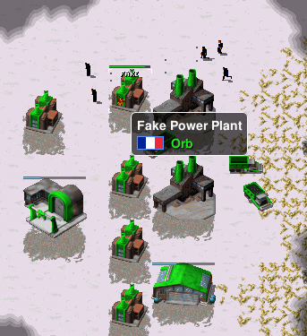

So - does building fakes actually help win games?  This graph shows the win rates for Allies players, France players and France players who built fakes. Since there weren't a huge number of France or Fake players then I've included some error bars.

There's not really much in it - fakes might or might not make a difference.  Probably a bigger impact is that often it's the same player building fakes and so the graph just shows the quality of that player. As an example, in Season 9 Morkel and Gormented built fakes way more often than anyone else, but they were also the players who forced picked France the most.

I had a look through the four Season 9 games with the most fakes, and the only example I found where they made a significant difference was Morkel vs WhoCares (RAGL-S09-MASTER-GROUP-MRK-WCS-G1.orarep).  WhoCares attacks early on, and Morkel was able to use the vision from the fakes to spot the threat, protect his real Power Plant and clean up for the loss of a few fakes.

It's a really cheap tier zero building, and you can recoup some of the cost by selling it again.  Consequently it makes sense that it doesn't change the course of many matches.  Personally I've found it fun to play with, but only if I notice that I'm playing as France!

Edit to add another example of fakes paying off - this time during the Season 7 finals.  Orb builds a row of Fake Power Plants and distracts Ganon's grens long enough for reinforcements to arrive.  Another great game, and FiveAces casted this match here (the game starts at 13:45):
https://www.youtube.com/watch?v=iCaM1H_I3UY

