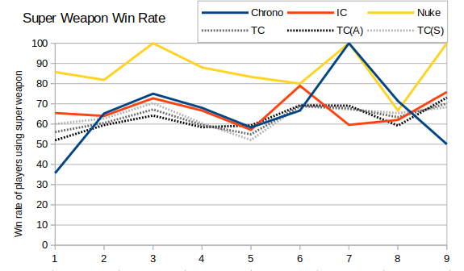

Having looked at the lowest tech defences, next we come to the super weapons.  The Chronosphere, Iron Curtain and Missile Silo all provide their ability in the form of a support power, so I thought it was worth comparing all the support powers in one go.

Three of the other support powers are tied to the Airfield, and one (Sonar Pulse) relies on getting a spy into an enemy Sub Pen/Naval Yard.  Due to the scarcity of spies and naval play (and bolstered by the fact that spies can't swim) then there has never been a Sonar Pulse used in a RAGL game.

For the first graph I calculated the percentage of games that feature each support power just considering those where it was possible.  For example the number of games featuring parabombs is out of the number of games that Ukraine was chosen, where as the number of games featuring a nuke is out of all games.  I also included as a baseline the percentage of games that featured a Radar Dome (which explains the prominent dips around Season 3 and 9).


I looked next at the average number of times each power was used (in games where the supply building was build).  (For Sonar Pulse I wasn't sure what the prerequisite build was, but it doesn't actually matter)


There's a lot of error in the points of this graph, due to the small data set. However I think we can see here that Chronospheres are used over twice as many times as Iron Curtains if they're built.  I think this is because Chronospheres have less chance of ending the game than Iron Curtains.

Also noteworthy is that half of the support powers get used less than once.  For nukes I can think of many factors that might cause this - the global timer is very long, nukes get sniped often, players sometimes surrender before the nuke is dropped.  I'm not sure why this would be for parabombs and paradrops though. The best reason I can think of is that players forget to use them.

So do super weapons help a player win?  This is a bit tricky to answer definitively, since super weapon play is relatively rare.  I've plotted the win rate of players who use the three super weapons each season, and also for comparison the win rate of players who build a Tech Centre (Any Tech Centre, Allied Tech Centre and Soviet Tech Centre, although there's not much difference).



The Iron Curtain line tracks closely to the Soviet Tech Centre.  I assumed this was simply because the Iron Curtain was a must-have for Soviets, but actually only 380 of the 1477 games where a Soviet Tech Centre is built see the Iron Curtain in use.  Players who drop a nuke generally win; not always, but a decent amount. The data here is pretty sketchy though - there are only 87 games that saw this (in fact it may be fewer games, since I'm considering each game separately for the two players).

The Chronosphere usage seems broadly similar to the Tech Centre lines.  One question asked on Discord was whether the German Chronoshift was better than the normal version.  The stats across all seasons suggest that the German version is actually worse than the normal one!
```
Win Rate for players using German Chronosphere: 25 / 46 = 54%
Win Rate for players using normal Chronosphere: 36 / 51 = 71%
```
