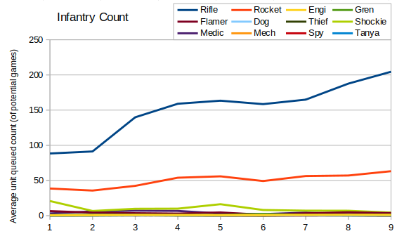
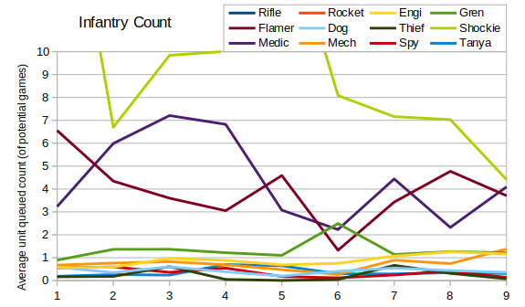
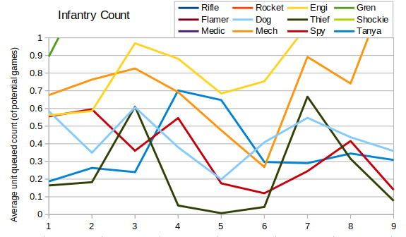

In the last post we looked at the numbers, but I failed to include any graphs.  In post this then I wanted to fix that.

Plotting the queue count for each unit then we can see that it has generally increased over the years.  Since RAGL started then the average number of rifles queued per game has more than doubled.

The graph also gives us a little insight into the rockets and shockies, but we need to zoom in to see much more.

From this graph then we can see a little more about shockies, medics and flamers.  It may seem surprising that shock troopers are in third place given how infrequently they're seen, but we're just considering the average number queued per game by players using an appropriate faction.  Russian players queue more shock troopers than Allies players queue medics or Soviet players queue flamers.  Presumably shock troopers are being spammed in the games they're used, since tier three isn't seen very often.  In release-20180923 they had a price increase and this coincides with a drop from 16 shockies per Russian player in Season 5 to 8 in Season 6.

Zooming in still further we can see that engineers and mechanics have had a resurgence, but that everything else has stayed roughly the same.  The thieves in Season 5 are perhaps worth an honourable mention - one player built two thieves in one game but sadly they lost.
