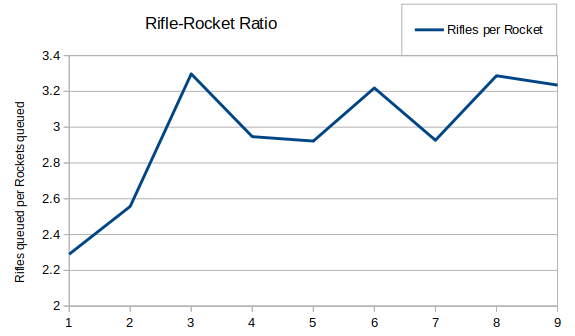
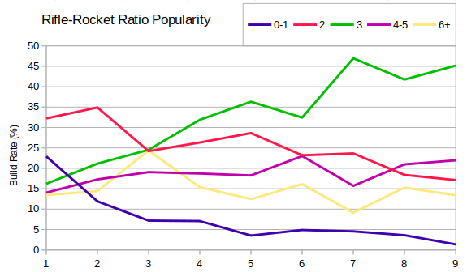
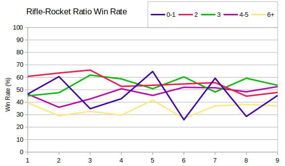

I mentioned already that the overall rifle to rocket ratio is pretty much 3 when averaged across all seasons.  Here's a quick graph showing the trend:

For the first couple of seasons there were considerably more rockets, but since about Season 3 we've seen this hover around the 3:1 mark.

Usually the question asked about rifle to rocket ratios is whether a 2:1 or 3:1 ratio is better.  For every build I rounded the rifle-rocket ratio to the nearest whole number and then bucketed into one of the following: 1 or fewer, 2, 3, 4-5, 6 or higher.  These buckets were chosen to be broadly a similar size:

We can see that 3:1 has steadily increased in popularity, while 2:1 and below have fallen.  Some players adapt their ratio as the game goes on, but I've simply considered their overall queue rate for rifles and rockets.

Next we can look at the win rates for the different ratios.  Broadly speaking 6:1 or higher seems to be a mistake.  A 1:1 ratio or more rockets than rifles also seems risky, although there were peaks in Seasons 5 and 7 when it seems to have paid off.  I guessed that these might be caused by players only queueing rifles, and then mixing rockets in as they're needed (since this could result in a huge number more rifles queued than rockets at the point the game ended).  When I just investigated the first hundred infantry produced then those peaks disappeared, and 1:1 also started to look like a suboptimal strategy.

Discounting these then it looks like recently 3:1 has been the best ratio, although there's really not much to call between the three middle ratios.
