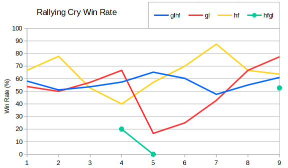
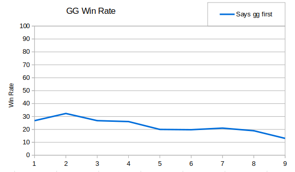

Thanks for the request to look into game length Jacko.  While getting started on that I got side tracked looking at the chat logs.  There are lots of conventions in RAGL, but one of the most contentious is whether to say "glhf" at the start.  The idea of wishing someone luck when they are playing against you seems a dubious strategy, but perhaps this is cancelled somewhat by persuading them to "have fun", rather than play properly. The raw numbers look like this:

```
Season  glhf   hf    gl   hfgl
   1   36.4%  2.6%  1.2%  0.2%
   2   35.2%  1.7%  4.0%  0.0%
   3   38.0%  1.1%  3.6%  0.0%
   4   45.2%  1.7%  2.7%  0.5%
   5   42.9%  1.2%  6.0%  0.2%
   6   46.6%  0.7%  9.4%  0.0%
   7   44.4%  1.2%  9.1%  0.0%
   8   50.7%  1.0%  5.5%  0.0%
   9   58.6%  3.7%  4.5%  2.5%
```

Looking at the rates which these wishes were made we can see that "glhf" is indeed the standard, and has steadily grown in popularity over the years.  The number of players who want their matches purely dependent on skill has held fairly steady - somewhere between one and two percent.  In Seasons 1 we saw a slightly higher rate, and in Season 9 a record-breaking 3.7%.  Players wishing just "gl" are presumably very confident in their own ability, and this saw a peak in Seasons 5 and 6.  For completeness I included the stats for "hfgl" - the choice of those players trying to confuse their opponents in the early game.

So what about the win rates?  I've looked at games where only one player gives a particular message, and calculated the win rate in just those games.



Due to the low number of games represented by some of these data points, there's a lot of error in the results. However the "glhf" line is backed up by a reasonable amount of games (e.g. 92 wins from 150 games in Season 9).  This shows that players saying "glhf" have done significantly better than those who don't.  Perhaps this is because very new players don't know about this convention, or perhaps because players who are panicking fail to type it correctly!

I also investigated whether saying glhf more times makes a difference.  This was fairly inconclusive, but it did throw up the following game between Bain and Admiral Mo which contains the most "glhf"s by the players:

```
RAGL-S08-MASTER-GROUP-AMO-BBB-G2.orarep abridged chat

Admiral mo: wp
Bain: wp
Bain: glhf
Admiral mo: glhf!
Bain: glhf
[Bain sets correct options]
Admiral mo: glhf
[Bain kicks a load of specs]
Battlefield Control: The game has started.
Bain: glhf!
^^ZxGanon^^|RV (Spectator): hf
Radical Centrist (Spectator): gl hf
Antarctica (Spectator): raglhf
...
Bain: GG
Admiral mo: gg
Antarctica (Spectator): gg
b�g: gg
Bain: gg wp
^^ZxGanon^^|RV (Spectator): gg
Admiral mo: you too!
goatkeeper (Spectator): gg
```

This brings us on to another very common message.  This time I looked at the win rate of the player who says "gg" first:



We can clearly see that saying "gg" first has never been a good tactic, but over the years it has got steadily worse.