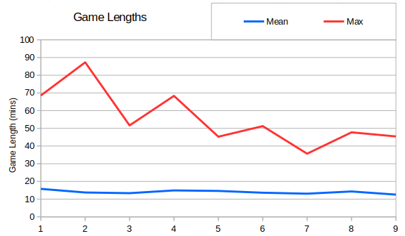
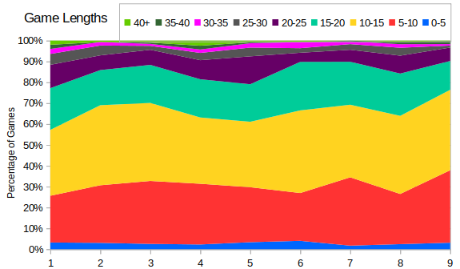

So an excursion into game lengths, and then I'll get back to looking at the infantry queue.  First - the average and maximum game lengths against season:



The graph clearly shows that the longest games have tended to get shorter over the seasons, but also the average game length has dropped too.  In Season 1 it was almost 16 minutes, and in Season 9 it was at a new low of 12 and a half.

When compiling these stats I excluded games that hadn't ended with a clear winner and loser. Some games included pauses, but this didn't have a big impact.  The longest games were as follows (and in fact none of them contained pauses):
```
Season 1: RAGL-S01-MINION-R09-TRX-ABC.orarep 68.5 minutes
Season 2: RAGL-S02-MASTER-R02-ABC-BRF.orarep 87.3 minutes
Season 3: RAGL-S03-MINION-R05-TTT-LUC.orarep 51.6 minutes
Season 4: RAGL-S04-RECRUIT-R06-SCR-DRG.orarep 68.3 minutes
Season 5: RAGL-S05-RECRUITB-R05-CRD-LAK.orarep 45.3 minutes
Season 6: RAGL-S06-MASTER-R03-UPS-UNO-G2.orarep 51.2 minutes
Season 7: RAGL-S07-MASTER-GROUP-ANJ-NNG-G1.orarep 35.7 minutes
Season 8: RAGL-S08-MASTER-GROUP-BUG-AMO-G2.orarep 47.7 minutes
Season 9: RAGL-S09-MASTER-GROUP-MRC-AMO-G2.orarep 45.4 minutes
```

Next I wanted to look at how the distribution of game lengths have changed over time.



The graph doesn't really show an obvious change in game lengths, but it does show that most games finish between 5 and 20 minutes.
