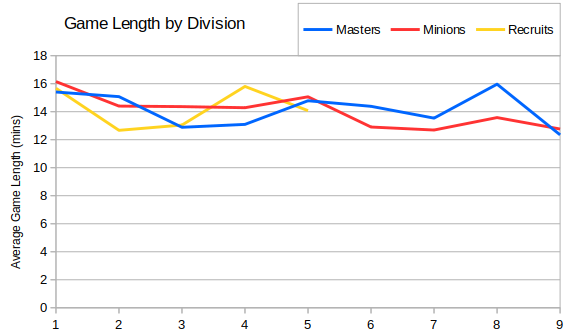
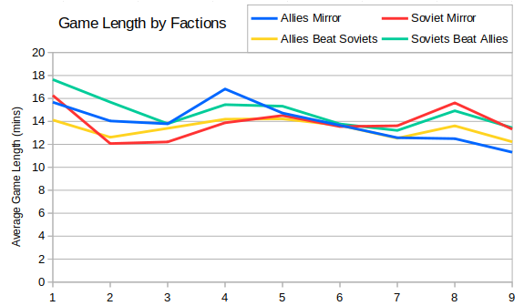

I had a few more thoughts about factors affecting game lengths.  First I noticed that the list of the longest matches had a bias towards Masters games.  I calculated the average game length for matches that specified which division they were from in the filename:



Overall it's possible that Masters games last slightly longer on average, but it's certainly not a consistent trend.

The other thing I wondered about was the notion of stalematey Allies mirror matches. I found the average game lengths for Allies and Soviet mirror matches, and I split the other games into those where Allies won and those where Soviets won:

 

I was quite surprised by this - it seems like in recent times then Soviet matches have lasted slightly longer on average.  This was backed up by the list of the longest matches - for each I looked up the factions involved and found that there were actually no Allies mirror matches at all.

```
Season 1: RAGL-S01-MINION-R09-TRX-ABC.orarep 68.5 minutes (Soviet v Soviet)
Season 2: RAGL-S02-MASTER-R02-ABC-BRF.orarep 87.3 minutes (Soviet v Allies)
Season 3: RAGL-S03-MINION-R05-TTT-LUC.orarep 51.6 minutes (Soviet v Allies)
Season 4: RAGL-S04-RECRUIT-R06-SCR-DRG.orarep 68.3 minutes (Allies v Soviet)
Season 5: RAGL-S05-RECRUITB-R05-CRD-LAK.orarep 45.3 minutes (Soviet v Soviet)
Season 6: RAGL-S06-MASTER-R03-UPS-UNO-G2.orarep 51.2 minutes (Allies v Soviet)
Season 7: RAGL-S07-MASTER-GROUP-ANJ-NNG-G1.orarep 35.7 minutes (Soviet v Soviet)
Season 8: RAGL-S08-MASTER-GROUP-BUG-AMO-G2.orarep 47.7 minutes (Soviet v Soviet)
Season 9: RAGL-S09-MASTER-GROUP-MRC-AMO-G2.orarep 45.4 minutes (Allies v Soviet)
```
