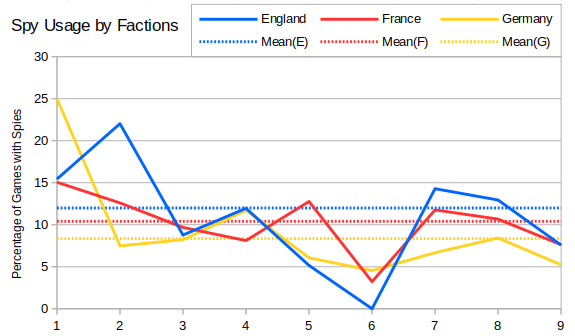
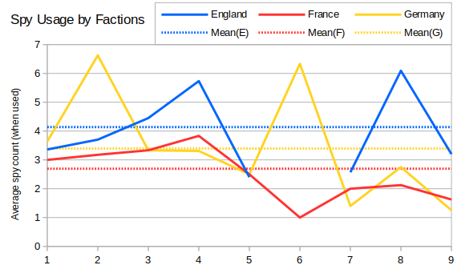

So back to the infantry queue.  I wanted to look at spies, and what sort of value the English spy provides.



Spies appear in about 10% of games, and slightly more often from English players than the other Allies.  In Season 6 there was an oddity because no English player queued a single spy.  On the whole then spy usage has fallen since Season 1, but has remained fairly steady since about Season 3 (except for an anomolous dip in Season 6).

If instead we consider the average number of spies built by players building at least one spy, then we get a graph like this:



Again we can see that English players use more spies on average than the other Allies.  Also, comparing with the last graph, France uses spies more often than Germany, but queues fewer of them per game.

I should also give an honourable mention to SirCakealot, as I have completely ignored his two spies built when playing as Russia (RAGL-S03-MINION-R04-BLK-SIR.orarep).  This was the only occasion a Soviet player obtained double tech and used it to build spies.

The value of English spies is limited by the quantity of spies that can usefully be built in a game.  I compiled a list of all games where a player queued ten or more spies.

```
33 spies by Medium Tank  (Germany) in RAGL-S02-MASTER-R07-MET-ABC.orarep
30 spies by Blackened    (England) in RAGL-S08-MINIONA-GROUP-BLK-PIE-G2.orarep
25 spies by Gatekeeper   (England) in RAGL-S03-MASTER-R02-GAT-FAR.orarep
15 spies by Unano        (Germany) in RAGL-S06-MASTER-R03-UPS-UNO-G2.orarep
14 spies by Bamsi        (England) in RAGL-S04-RECRUITA-R06-LOF-BAM.orarep
14 spies by SeaCucumber  (England) in RAGL-S04-RECRUIT-R06-SCR-DRG.orarep
13 spies by Mr Bain      (England) in RAGL-S08-MASTER-GROUP-UPS-BBB-G1.orarep
12 spies by NoobMapMaker (Germany) in RAGL-S01-MINION-R07-JAY-NMM.orarep
12 spies by Firekeeper   (England) in RAGL-S02-MASTER-R07-FIV-GAT.orarep
11 spies by kyrylo       (England) in RAGL-S01-MASTER-R01-KYR-MTR.orarep
11 spies by Barf         (England) in RAGL-S02-MASTER-TIEBREAK-BRF-GAT-1.orarep
11 spies by Barf         (England) in RAGL-S02-MASTER-R06-FIV-BRF.orarep
11 spies by Craig Christ (England) in RAGL-S04-RECRUITB-R06-LCN-CCT.orarep
11 spies by SeaCucumber  (England) in RAGL-S04-RECRUIT-R02-SCR-MAN.orarep
11 spies by SeaCucumber  (England) in RAGL-S04-RECRUIT-R01-SCR-MAN.orarep
10 spies by 3. Lucian    (England) in RAGL-S04-RECRUIT-R04-LCN-MCV.ORAREP
10 spies by mechANIC     (England) in RAGL-S04-RECRUIT-R04-LCN-MCV.ORAREP
10 spies by Bamsi        (England) in RAGL-S04-RECRUITA-R02-S84-BAM.orarep
10 spies by Bain         (England) in RAGL-S09-MASTER-GROUP-MRC-AMO-G2.orarep
```

We can see a very high proportion of players using England here, although the most spies queued was by Medium Tank as Germany.  In this game Medium Tank apparently queued 33 spies, which seemed a bit insane, so I investigated further.  Sadly the replay was too old for me to watch, but the list of actions involving spies looks something like this:

```
Start production of 5 spies
Start production of 5 spies
Start production of 5 spies
Start production of 5 spies
Start production of 5 spies
Start production of 5 spies
Start production of 5 spies
Start production of 5 spies
Start production of 5 spies
Start production of 5 spies
Start production of 5 spies
Start production of 5 spies
Start production of 5 spies
[Some other stuff]
Start production of 5 spies
Start production of 5 spies
[Lots of other stuff]
Pause production of a spy
Pause production of a spy
Pause production of a spy
Cancel production of 14 spies
Cancel production of 14 spies
Cancel production of 14 spies
```

I'm not 100% sure I've interpretted the file correctly, but it does look very much like the spies were queued by accident, and then they were cancelled once MT realised.

The second entry in the list is by Blackened in Season 8, so I was able to watch the replay.  In this case Blackened queued thirty spies right near the end of the game but only two hit the field and neither made it near the enemy base.

The third entry (Gatekeeper in Season 3) seems very similar - 25 spies queued right near the end of the game.

These go to show the limitations of looking at the number of units queued.  When a player queues a lot of an unusual unit then it is often a mistake or inconsequential to the outcome of the game.  It would be better to instead somehow add instrumentation to the official replay client that is able to output the events that actually happened in the game.

The fourth entry in the list is from Unano, and he actually does build a lot of spies.  However it's probably worth keeping this in the contex of the rest of his build - single barracks into Tech Center, Tanya (immediately sniped) and a bunch of spies (most get a disguise, but Upps spots them anyway), twin gap generators and a wall of camo pillboxes.  He also throws in a lategame transition into light tank spam and crushes two of his disguised spies by chronoshifting enemy tanks on top of them.  Fifteen spies are built and they are all killed off in some way or another without generating any value.

So even in this extreme case, if Unano had been England then he would have only saved himself $3750 on spies - that's about 20 rifles and 6 rockets (or 4 light tanks and a gap generator) - and he wouldn't have been able to pull off the same stunts using the German Chronosphere.
