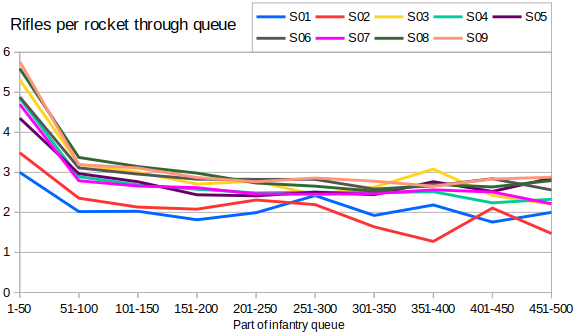
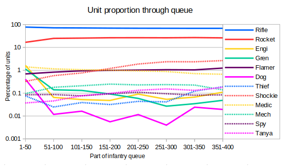

I thought back to the rifle-rocket ratio post from earlier, and wondered if there was a noticable change in the ratio as the game went on.  Here I've plotted a line for each season.  It's a bit difficult to interpret this graph, so the S01 point at (1-50, 3) means that the average r-r ratio for the first 50 infantry during games in Season 1 was 3.  The next point on the same line is roughly at (51-100, 2) which means that the average r-r ratio for the next 50 infantry during those games was 2.

Other than explaining how to read it, there's not a huge amount to talk about for this graph.  In every season then the rifle count starts high, drops and then levels off.  This makes sense because it's very unusual to see rockets on the field in the first batch of units.  Seasons 1 and 2 are noticable outliers with far more rockets per rifle, but otherwise they follow the same trend.

This got me wondering about other units, and how the proportions change during the game.  I've plotted these on a logarithmic scale to try to make the graph a bit more readable.  Each line in this graph is the average over all nine seasons of RAGL.

At the top we have rifles and rockets - between them making up >95% of the infantry. As discussed then the rifle percentage drops during the game, as the rocket density increases.

Engineers, grens and dogs are all early game units. Players perhaps make one or two in the first 50 units, but after that they're very rare.  Perhaps it's experimental error, but all three seem to have a very slight uptick in popularity after the first 300 units.

Most of the other units stay fairly level. Tanya and shock troopers are obviously more likely to be seen in the late game since they require a Tech Center.  Shock troopers can only be build by Russia, so when they reach 2-3% of all units that translates to something like 10-15% of all Russian units.

Flamers have a very slight increase in popularity as the game goes on, which is possibly because they're great at cleaning up buildings to close out a game.  Medics conversely have a very slight decrease in popularity during the game. Perhaps this is because there are more units that one-shot infantry later on (artis, V2s, Tanya, shockies, etc.).