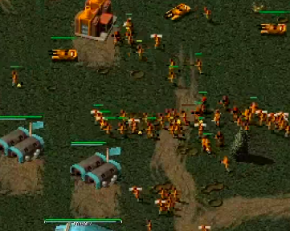
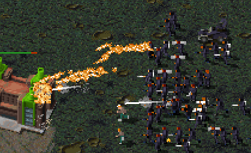
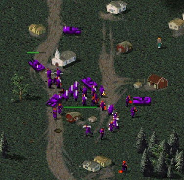

Finishing off this series of posts about infantry let's look at the players who've used (queued) the most of each unit in a game.  Here's the list, and I've included the game duration too:

```
Rifle    1920 morkel (RAGL-S09-MASTER-GROUP-MRK-ILM-G1.orarep - 38 minutes)
Rocket    782 morkel (RAGL-S09-MASTER-GROUP-MRK-ILM-G1.orarep - 38 minutes)
Engineer   16 WaRRyKeR (RAGL-S04-RECRUITC-R08-XY-WKR.orarep - 24 minutes)
Gren       59 SirCakealot (RAGL-S06-MINION-R01-JJK-SIR-G2.orarep - 19 minutes)
Flamer    115 netnazgul (RAGL-S05-MINION-R02-NNG-SOT-G2.orarep - 37 minutes)
Dog        20 dragunoff (RAGL-S04-RECRUIT-R06-SCR-DRG.orarep - 68 minutes)
Thief     125 Booby (RAGL-S03-RECRUIT-R11-BOO-OTQ.orarep - 22 minutes)
Shockie   281 Anykeyich (RAGL-S04-RECRUITC-R06-ANY-WKR.orarep.orarep - 20 minutes)
Medic     138 lucassss (RAGL-S03-MINION-R10-LUC-KUB.orarep - 17 minutes)
Mechanic   36 Kernel Panic (RAGL-S09-MINION-GROUP-KNL-ICE-G2.orarep - 28 minutes)
Spy        33 Medium Tank (RAGL-S02-MASTER-R07-MET-ABC.orarep - 30 minutes)
Tanya      39 SeaCucumber (RAGL-S04-RECRUIT-R06-SCR-DRG.orarep - 68 minutes)
```

We already looked at spies, and saw that just because someone queues a lot of a unit, it doesn't mean they're going to produce them.  Other factors also need to be considered, such as the game ending before the units are produced.

Rifles and rockets form the core of an army and we saw before that the number queued has been creeping up over the seasons.  Morkel holds the record for the most of both queued in a game, and it was an incredible game.  Five Aces casted this game here: https://www.youtube.com/watch?v=zK-EglXyuBM



This queuing is a little ridiculous though because even at maximum production speed (rifle=1.2s, rocket=3.6s) then this queue would take 85 minutes to get through, and the game finished after 38.  For comparison then ILM only queued 976 rifles and 372 rockets - the equivalent of about 42 minutes.

The most Tanyas queued in a game is in a really long game, which makes sense, but 39 still sounded like an awful lot. It turns out that this is because SeaCucumber was using shift-queuing which is niavely interpretted by my script as adding 5 Tanyas at once. The game engine only allows a single Tanya to be built at a time though, so there are more like 10-20 Tanyas in the game.

The highest flamer count is from a game between Netnazgul and Sotsch. Net goes for a 10 rifle, 5 rocket, 5 flamer mix of infantry for most of the game with mixed success.  You can watch the replay via SoScared stream - it's a really nice game with most of the Soviet tech tree on display. Game 2 starts at about 17 minutes: https://www.twitch.tv/videos/251359565



The player with the most (queued) mechanics was Kernel Panic in Season 9 (RAGL-S09-MINION-GROUP-KNL-ICE-G2.orarep). Kernel Panic manages to grab something like nine heavies and seven mammoths, as well as reviving several of his ore trucks.  Unfortunately this was one of the few S09 Minions matches that Biomecaman didn't cast, however you can watch a similar strategy by Kernel Panic against Duke Bones here: https://www.youtube.com/watch?v=CqZ1JqHIm2A (Beware the global rachet sound effect is quite obnoxious after a while).

