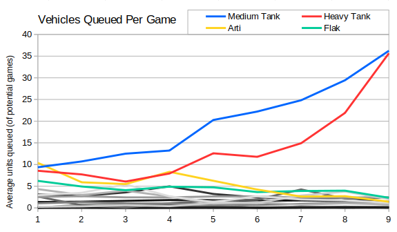

The next queue is the vehicles.  We have all the same caveats for vehicles as we do for infantry - the replay format doesn't tell us whether the unit is produced, only whether it is added to the queue.  Disclaimers out of the way, the raw numbers for each season look like this:

```
SEASON 1
Arti: 3104 (215 builds (42%), 49% wins)
Medium Tank: 2801 (198 builds (39%), 58% wins)
Heavy Tank: 1772 (136 builds (27%), 54% wins)
Flak: 1290 (123 builds (24%), 48% wins)
Harvester: 1281 (427 builds (84%), 49% wins)
APC: 896 (156 builds (31%), 48% wins)
Light Tank: 878 (164 builds (32%), 48% wins)
MCV: 686 (395 builds (78%), 52% wins)
V2: 640 (94 builds (19%), 48% wins)
Ranger: 314 (197 builds (39%), 53% wins)
Tesla Tank: 238 (25 builds (5%), 65% wins)
Mammoth Tank: 51 (6 builds (1%), 40% wins)
Demo: 30 (11 builds (2%), 55% wins)
Radar Jammer: 18 (10 builds (2%), 80% wins)
Phase Transport: 16 (4 builds (1%), 33% wins)
Minelayer: 15 (13 builds (3%), 50% wins)
Mobile Gap Generator: 13 (8 builds (2%), 50% wins)
Supply Truck: 5 (5 builds (1%), 20% wins)

SEASON 2
Medium Tank: 4392 (286 builds (48%), 62% wins)
Arti: 2421 (243 builds (41%), 53% wins)
Harvester: 1605 (533 builds (89%), 50% wins)
Heavy Tank: 1436 (122 builds (20%), 48% wins)
Light Tank: 1429 (217 builds (36%), 49% wins)
Flak: 918 (116 builds (19%), 46% wins)
MCV: 854 (483 builds (81%), 54% wins)
Ranger: 551 (310 builds (52%), 54% wins)
APC: 551 (142 builds (24%), 43% wins)
V2: 511 (91 builds (15%), 48% wins)
Chrono Tank: 87 (8 builds (1%), 88% wins)
Mammoth Tank: 65 (8 builds (1%), 75% wins)
Tesla Tank: 55 (5 builds (1%), 80% wins)
Phase Transport: 31 (14 builds (2%), 50% wins)
Radar Jammer: 30 (13 builds (2%), 62% wins)
Minelayer: 27 (15 builds (3%), 80% wins)
Demo: 24 (9 builds (2%), 67% wins)
Mad Tank: 12 (3 builds (1%), 100% wins)
Mobile Gap Generator: 10 (5 builds (1%), 100% wins)
Supply Truck: 4 (4 builds (1%), 75% wins)

SEASON 3
Medium Tank: 4540 (259 builds (40%), 58% wins)
Arti: 1993 (172 builds (27%), 48% wins)
Light Tank: 1969 (200 builds (31%), 47% wins)
Heavy Tank: 1682 (159 builds (25%), 55% wins)
Harvester: 1555 (570 builds (89%), 52% wins)
Flak: 1131 (165 builds (26%), 54% wins)
APC: 1099 (186 builds (29%), 47% wins)
MCV: 1042 (523 builds (82%), 55% wins)
V2: 990 (107 builds (17%), 50% wins)
Ranger: 378 (266 builds (42%), 48% wins)
Mammoth Tank: 170 (17 builds (3%), 88% wins)
Mad Tank: 95 (2 builds (0%), 100% wins)
Chrono Tank: 54 (4 builds (1%), 75% wins)
Minelayer: 28 (16 builds (2%), 50% wins)
Phase Transport: 18 (10 builds (2%), 20% wins)
Tesla Tank: 11 (4 builds (1%), 50% wins)
Demo: 10 (8 builds (1%), 50% wins)
Radar Jammer: 4 (4 builds (1%), 75% wins)
Mobile Gap Generator: 4 (3 builds (0%), 100% wins)
Supply Truck: 1 (1 builds (0%), 0% wins)

SEASON 4
Medium Tank: 5766 (341 builds (35%), 52% wins)
Heavy Tank: 4380 (397 builds (40%), 56% wins)
Arti: 3629 (259 builds (26%), 46% wins)
V2: 2743 (341 builds (35%), 55% wins)
Flak: 2698 (360 builds (36%), 54% wins)
Harvester: 2393 (896 builds (91%), 52% wins)
MCV: 1789 (866 builds (88%), 53% wins)
APC: 1448 (362 builds (37%), 50% wins)
Light Tank: 1163 (180 builds (18%), 47% wins)
Ranger: 444 (271 builds (27%), 51% wins)
Mammoth Tank: 219 (30 builds (3%), 87% wins)
Tesla Tank: 219 (21 builds (2%), 48% wins)
Demo: 66 (27 builds (3%), 52% wins)
Phase Transport: 58 (23 builds (2%), 57% wins)
Chrono Tank: 45 (2 builds (0%), 100% wins)
Minelayer: 42 (24 builds (2%), 46% wins)
Radar Jammer: 22 (16 builds (2%), 75% wins)
Supply Truck: 10 (6 builds (1%), 33% wins)
Mobile Gap Generator: 2 (2 builds (0%), 50% wins)

SEASON 5
Medium Tank: 4257 (177 builds (37%), 59% wins)
Heavy Tank: 3425 (230 builds (48%), 50% wins)
Arti: 1313 (125 builds (26%), 56% wins)
Flak: 1290 (174 builds (36%), 45% wins)
Harvester: 1273 (445 builds (92%), 52% wins)
V2: 875 (146 builds (30%), 45% wins)
MCV: 869 (429 builds (89%), 51% wins)
Mammoth Tank: 304 (36 builds (7%), 72% wins)
Light Tank: 282 (88 builds (18%), 48% wins)
APC: 272 (137 builds (28%), 44% wins)
Tesla Tank: 230 (21 builds (4%), 76% wins)
Ranger: 171 (130 builds (27%), 60% wins)
Demo: 35 (19 builds (4%), 47% wins)
Chrono Tank: 33 (4 builds (1%), 75% wins)
Phase Transport: 17 (9 builds (2%), 67% wins)
Minelayer: 13 (12 builds (2%), 75% wins)
Radar Jammer: 12 (8 builds (2%), 75% wins)
Mobile Gap Generator: 7 (4 builds (1%), 75% wins)
Supply Truck: 5 (2 builds (0%), 0% wins)
Mad Tank: 5 (1 builds (0%), 0% wins)

SEASON 6
Heavy Tank: 4441 (314 builds (57%), 52% wins)
Medium Tank: 3888 (143 builds (26%), 57% wins)
Harvester: 1441 (501 builds (91%), 52% wins)
Flak: 1376 (207 builds (38%), 46% wins)
V2: 908 (165 builds (30%), 57% wins)
MCV: 905 (486 builds (88%), 52% wins)
Arti: 741 (77 builds (14%), 57% wins)
APC: 510 (192 builds (35%), 47% wins)
Light Tank: 470 (60 builds (11%), 46% wins)
Mammoth Tank: 435 (48 builds (9%), 75% wins)
Tesla Tank: 383 (28 builds (5%), 79% wins)
Ranger: 120 (99 builds (18%), 69% wins)
Minelayer: 25 (13 builds (2%), 31% wins)
Demo: 20 (18 builds (3%), 56% wins)
Supply Truck: 10 (5 builds (1%), 80% wins)
Radar Jammer: 7 (3 builds (1%), 67% wins)
Phase Transport: 3 (2 builds (0%), 50% wins)

SEASON 7
Medium Tank: 5982 (214 builds (36%), 54% wins)
Heavy Tank: 5233 (301 builds (51%), 51% wins)
Harvester: 1420 (538 builds (91%), 50% wins)
Flak: 1368 (252 builds (43%), 50% wins)
MCV: 1019 (549 builds (93%), 52% wins)
Mammoth Tank: 1001 (62 builds (10%), 73% wins)
Tesla Tank: 732 (34 builds (6%), 76% wins)
V2: 709 (148 builds (25%), 58% wins)
Arti: 630 (100 builds (17%), 54% wins)
Light Tank: 470 (90 builds (15%), 42% wins)
APC: 253 (158 builds (27%), 47% wins)
Ranger: 223 (174 builds (29%), 54% wins)
Radar Jammer: 33 (17 builds (3%), 94% wins)
Minelayer: 31 (22 builds (4%), 59% wins)
Demo: 22 (12 builds (2%), 17% wins)
Phase Transport: 16 (9 builds (2%), 67% wins)
Mobile Gap Generator: 9 (4 builds (1%), 100% wins)
Supply Truck: 3 (1 builds (0%), 100% wins)

SEASON 8
Medium Tank: 7507 (230 builds (40%), 53% wins)
Heavy Tank: 7163 (286 builds (49%), 53% wins)
Harvester: 1389 (531 builds (91%), 51% wins)
Flak: 1300 (241 builds (41%), 49% wins)
Mammoth Tank: 1233 (78 builds (13%), 71% wins)
MCV: 940 (534 builds (92%), 52% wins)
V2: 758 (163 builds (28%), 54% wins)
Arti: 688 (127 builds (22%), 44% wins)
Light Tank: 441 (118 builds (20%), 45% wins)
APC: 346 (135 builds (23%), 50% wins)
Tesla Tank: 344 (18 builds (3%), 50% wins)
Ranger: 312 (196 builds (34%), 53% wins)
Demo: 47 (31 builds (5%), 52% wins)
Radar Jammer: 42 (17 builds (3%), 59% wins)
Minelayer: 41 (22 builds (4%), 45% wins)
Chrono Tank: 9 (2 builds (0%), 50% wins)
Supply Truck: 6 (2 builds (0%), 50% wins)
Mobile Gap Generator: 4 (3 builds (1%), 33% wins)
Phase Transport: 3 (3 builds (1%), 33% wins)

SEASON 9
Heavy Tank: 16329 (421 builds (50%), 45% wins)
Medium Tank: 14131 (362 builds (43%), 58% wins)
Harvester: 2091 (789 builds (93%), 51% wins)
MCV: 1101 (786 builds (93%), 51% wins)
Flak: 1069 (304 builds (36%), 45% wins)
Mammoth Tank: 935 (67 builds (8%), 71% wins)
V2: 639 (158 builds (19%), 57% wins)
Arti: 555 (119 builds (14%), 60% wins)
Ranger: 523 (316 builds (37%), 57% wins)
Light Tank: 462 (142 builds (17%), 55% wins)
APC: 360 (190 builds (22%), 38% wins)
Tesla Tank: 344 (13 builds (2%), 77% wins)
Minelayer: 110 (89 builds (10%), 44% wins)
Chrono Tank: 52 (4 builds (0%), 25% wins)
Demo: 39 (23 builds (3%), 32% wins)
Radar Jammer: 21 (16 builds (2%), 62% wins)
Phase Transport: 14 (4 builds (0%), 75% wins)
Mobile Gap Generator: 2 (1 builds (0%), 0% wins)
Mad Tank: 1 (1 builds (0%), 100% wins)
```

Unsurprisingly the most queued vehicles are heavy tanks and mediums.  In earlier seasons then artilleries top the table, which ties in with the greater popularity of radar play and Allies.  I've heard from several sources that arti spam used to be the standard strategy in older seasons (although interestingly it only has a 49% S01 win rate compared with 58% for medium tanks).

The next graph takes the number of each unit queued and divides it by the number of times it was possible to queue it.  There are twenty different vehicles (ignoring minor differences like the two types of minelayer) which is really too much for one graph, so I've tried to highlight the top four in colour.



After heavies we can see that flak tracks are the most popular unit for Soviet players. Given they're a common light vehicle pre-service depot and they're also useful post radar dome for harassing artilleries and anti-air then this is unsurprising.

In the next post then we'll have a look at medium tanks vs heavy tanks a bit more.
