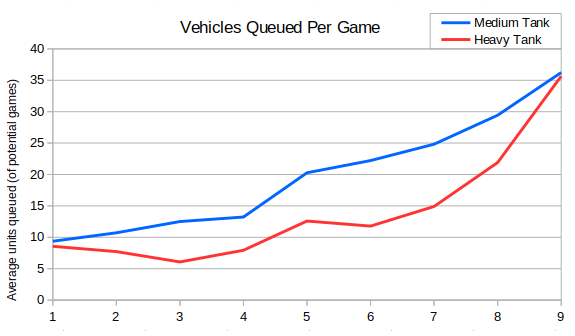
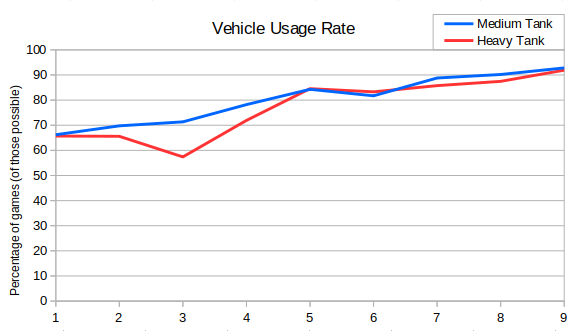
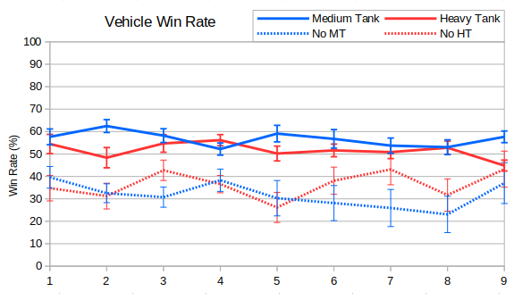

We saw in the previous post that medium and heavy tank production dominates all other vehicles.  Here's the same graph again, showing that we're approaching the "OpenRA tank singularity" as SirCake put it:



Heavy tanks take longer to produce than mediums and so it would make sense for Soviet players to have shorter tank queues than Allies.  However in Season 9 we saw the queue lengths roughly match.  I think the reason the same number of heavies and mediums are now queued is predominantly due to the priority queue feature.  An 'infinite' queue of tanks can be maintained and other items can be added to the front of the queue (using Ctrl).  This was added in Release 20190314, which translates to RAGL Season 7.  The explanation isn't particularly satisfactory though, since the medium-heavy gap actually widened between Seasons 6 and 7 (by an average of 0.03 tanks per game). Anyway we've continued to see tank queues increase in length in a similar way to rifle and rocket soldiers.

We mentioned earlier that building a service depot has increasingly become the only approach, and so it shouldn't be surprising to also see the production of medium and heavy tanks becoming the norm. Perhaps Soviet players have a few more rush options than Allies, and so the heavy tank line trails a bit below the medium tank line.



Finally I wanted to look at win rates for heavies and mediums. The win rates for MT and HTs are pretty much the same as the win rates for Allies and Soviets, but with the start of the graph shifted up a bit. Given how prevalent these tanks are then I also wanted to look at the win rates for players who didn't build any (but who did had the opportunity to).



Here we can see that skipping tanks is on the whole quite risky. For Allies it seems fairly clear that it's less than optimal. For Soviets then it didn't used to be good, but in Season 9 then it was comparable. Partly this seems to be because 'normal' builds by Soviets did worse than normal.

Also we can see that there's more error in the results for skipping tanks, because fewer players did it.  In fact there were so few replays where Allied players skipped medium tanks that I thought it was worth having a look through them.  From Season 9 we just had the following list of games where an Allied player won without a medium tank:

```
SinJul RAGL-S09-MINION-GROUP-GOR-SIN-G2.orarep Ranger Danger
WhoCares RAGL-S09-MASTER-GROUP-GOA-WCS-G2.orarep Triple-Ref-All-In
WhoCares RAGL-S09-MASTER-GROUP-GOA-WCS-G1.orarep Triple-Ref-All-In
morkel RAGL-S09-MASTER-GROUP-MRK-FIV-G1.orarep 3:35 gg
Kernel Panic RAGL-S09-MINION-GROUP-S84-KNL-G2.orarep Ranger Danger
SinJul RAGL-S09-MINION-GROUP-S84-SIN-G2.orarep Defended against Double-Ref-All-In
Zaqzorn RAGL-S09-MINION-GROUP-ZAQ-KNL-G2.orarep Double-Ref-All-In
```

The matches between Goat and WhoCares are particularly worth watching, as they are very high quality examples of how to Triple-Ref-All-In.