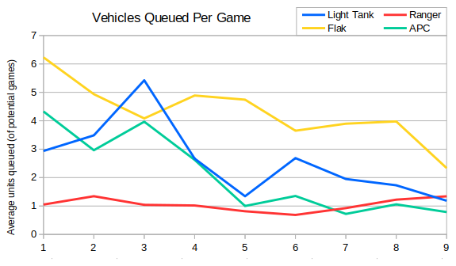
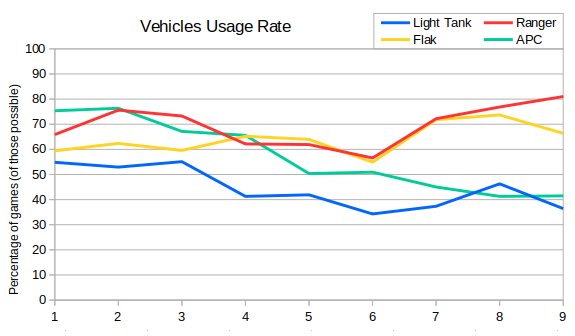
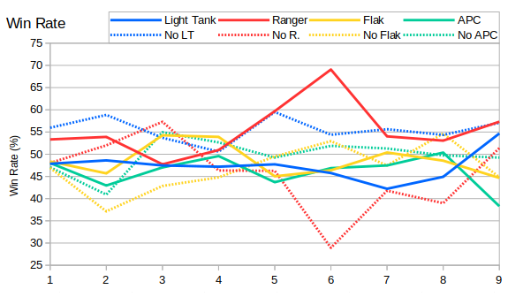

Next let's have a look at the light (pre-SD) vehicles.  If we consider the average number build per game then we can see flaks are generally the most popular.  Light tanks and APCs have some occasional late game uses, but flaks are good early game against infantry (for vision) and late game against air and artis/V2s.

The average number of flaks per game has dropped over time. This is probably because they were built as a counter to radar units, and radar dome usage has dropped. Similarly we can see that light tank and APC usage has dropped. I think they used to be popular because players didn't build a service depot so often, and so they were the most durable units available.

Next let's look at how often the light vehicles are seen in a game.

Even though the quantity of flaks and light tanks has dropped, they are still being built by roughly the same percentage of players. Perhaps this shows that light tanks are still useful as an early vehicle, even if they're not used as part of the main army. APC usage is the most significant change - roughly half as many games saw an APC in S09 compared with S01.

Rangers are in an interesting spot. Allied players build them far more frequently than light tanks, but one is generally enough.  This matches with the view that rangers are only useful early game - players get one of them for vision and never build another.

So to finish this post off, let's look at the win rates. As for medium/heavy tanks I've included the win rates for players who chose not to build each vehicle too.

The biggest discrepancy is for rangers - particularly in Seaon 6. An Allied player building a ranger was more than twice as likely to win compared with one who didn't. More recently the gap is much smaller, and light tanks seem a reasonably valid choice. It's worth noting that building light tanks still seems slightly worse than not building light tanks though!

For Soviets then the lines are much closer. There's a small advantage for flaks over APCs, and we can see that players who don't choose APCs also do well. In S09 then Soviets did roughly 10% worse than Allies, which explains why all Soviet options are lower than the Allied ones.

In the next post we'll focus on the early game by restricting the figures to the first five vehicles.
