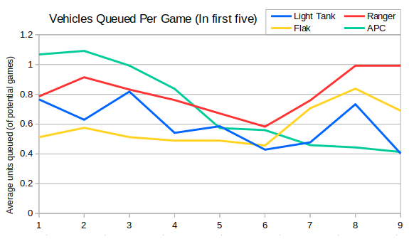
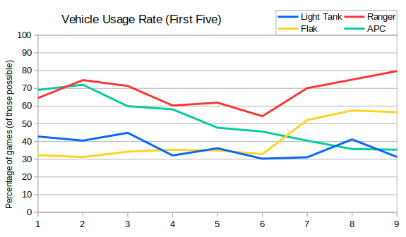
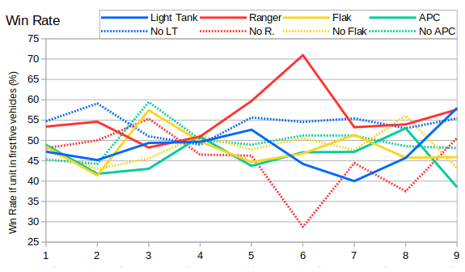

As promised, next I wanted to look at how light vehicles are used in the early game. I've tried to keep the graphs in this post similar to the previous post to enable comparison.  First up here are the average number of each light vehicle when restricted to only the first five vehicles (and averaging only over games where it was possible to build that vehicle - i.e. by Allies/Soviets).



The first obvious thing is the average totals are much lower. Many of the first five vehicles are harvesters, and so the average ends up somewhere near to one for each. The line for rangers is almost unchanged from the previous graph, suggesting that, while it's the most popular unit here, it's pretty much obsolete after the early game.

APC usage has dropped off, as has light tank usage to an extent.  Comparing against the graph from last time we can see that the number of flaks used during the game has dropped significantly since Season 1, but the number built in the early game has slightly risen.

Next is the vehicle usage graph, which shows the percentage of Allies/Soviet players that built at least one of the given light vehicle.  Again this graph is restricted to the first five vehicles built.



Unsurprisingly the line for rangers is almost identical to the usage graph from the previous post. About 75% of rangers appear in the first five vehicles, so it follows that the usage of those rangers will dominate the usages of the other 25%.  However since the usage percentages are about the same then we also know that the 25% of rangers are being built by players who already built one - i.e. no one is transitioning into rangers, but perhaps some players are doing a Ranger Danger build.

We can see that APC and Light Tank usage in the first five vehicles is broadly similar to the rest of the game. The raw percentages are about 5% lower though, so about 5% of players transition to them later, even though they didn't build one at the start. From experience this happens when your SD gets sniped, and you still want to build armour.

Flak usage in the early game is quite different from the whole game. I think this might be because historically they were used against prevalent radar units and APCs were better in the early game; now there are less radar units built but they're more popular in the early game.

Finally for completeness I've included the win rate graphs for building (and not building) each light vehicle in the first five units.



For the most part this graph looks very similar to the whole game win rates.  There is one interesting point of variation that I noticed, which is that in Season 9 it was just as good to build a light tank or a ranger in the first five units. Furthermore, it was better to build a light tank as an early vehicle than not to build one. Given the often heard view that light tanks are underpowered then I thought it would be good to look at the win rates of all four options in Season 9:

```
Ra LT:  41/ 71 (57.75%)
Ra --: 137/238 (57.56%)
-- LT:  28/ 48 (58.33%)
-- --:  11/ 29 (37.93%)
```

Admittedly there's a reasonable margin of error and many other factors influencing the results, but the data suggests that in Season 9 it was best to open with a light tank and not to build a ranger at all.