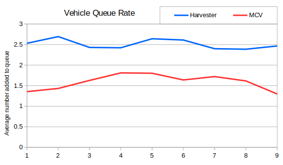
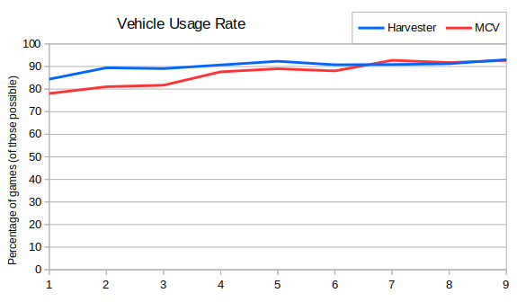
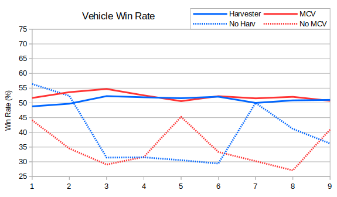

Next up are harvesters and MCVs.  I grouped them together because they're (almost) essential units and because they can't attack.  One convenient feature of them is that they're available to all players, so it makes the percentages slightly easier to compute.

Looking at the average number of each queued by season we end up with one of the most constant looking graphs so far. On average players have made 2.5 harvesters and 1.5 MCVs per game.  The two main build orders (as detailed in the academy) each result in two harvesters and one MCV in the first five vehicles, which suggests there might be very few produced later in the game.  It's possible that some players produce no harvesters or no MCVs, so let's look at how prevelent they are:

So both units were standard in Season 1, and have got more ubiquitous since then.

Are they good units to build?

So yes they're good units to build. If you don't build an MCV or don't build an ore truck then you're likely to lose.  One reason not to build either unit is if you're attempting an all-in another is because you made a mistake. Both are risky strategies.
