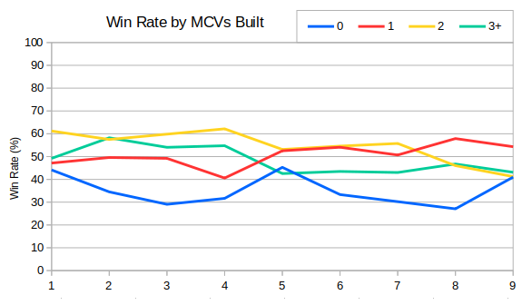
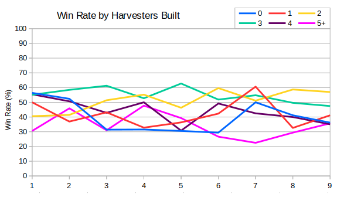

Last time we looked at some stats relating to harvesters and MCVs.  I wanted to continue that by looking at how many of each should be built.

First MCVs - I found that generally builds could be grouped into four buckets - no MCVs, one MCV, two MCVs and three or more MCVs. This obviously doesn't include the MCV that each player gets to start.

This shows that 2 or maybe 3 MCVs used to be the sweet spot, but by Season 9 the most reliable option was to build a single MCV.  The extra utility from the first MCV is huge compared with that of subsequent ones.  It allows you to continue producing buildings and defences while you drive one of them to a new location.  Also often the reason for building a second MCV is that the first was destroyed, so the win rate for higher numbers of MCVs will be naturally lowered due to this.

Harvesters are a little trickier - there are more of them, and so I did the same analysis with six buckets.

Here we can see that two has always been a good number, and that three has become more reasonable recently.  I found it intriguing that 4 and 0 harvesters had good results in Season 1, but by Season 9 they seem much less successful.