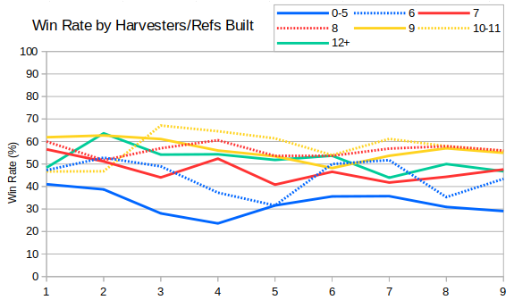
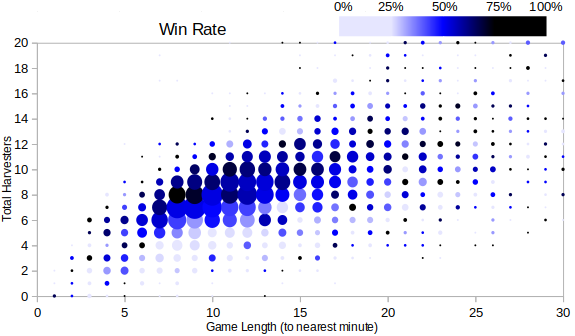

As suggested by SirCake I investigated including refs into the harvester count. Each refinery comes with a harvester and, as it only costs $300 more, most of the investment is in the vehicle.

Trying to repeat the analysis into harvester win rate by season I found that it was helpful to use seven buckets.  It's a little hard to read, but we can see that adjacent buckets have had similar win rates.

So for example in Seasons 7, 8 and 9 the best total harvester count was 8, 9 or 10-11. In contrast in Season 1 the optimal count was slightly fewer - between 7 and 9. The worst harvester count has consistently been 0-5, followed by 6.

Games in earlier seasons were slightly longer on aveage than they are now, so perhaps it's also worth looking at the win rate of different harvester counts for games of different lengths.  For every game (combining all seasons) I counted the number of harvesters a player built (refs and harvesters) and plotted it against the game length to the nearest minute.  Each bubble on the graph has a size showing how many results it represents and a colour showing the win rate.  Light blue means that the combination is bad, black means that the combination is good.

The first thing that stands out is that we can see that longer games usually have more harvesters, and that most games last around 5-20 minutes, although there's a long tail of 30 minute plus games that aren't even included on the graph.

Focusing on the middle section then there's a sweet spot of 8 harvesters for games that last 8 or 9 minutes. This seems to be considerably better than having 6-7 harvesters, which in turn is a huge improvement on having 5 or fewer.  For 10 minute games then 9 harvesters seems best, and for games that finish after 11-16 minutes then 10 harvesters seems to be about optimal.
