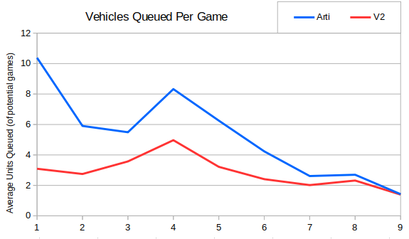
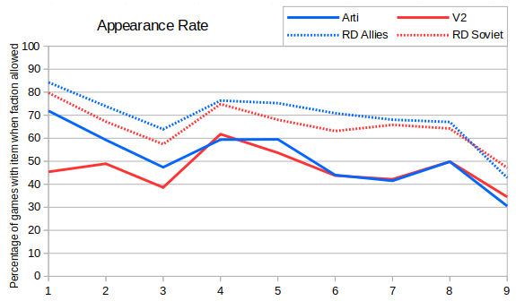
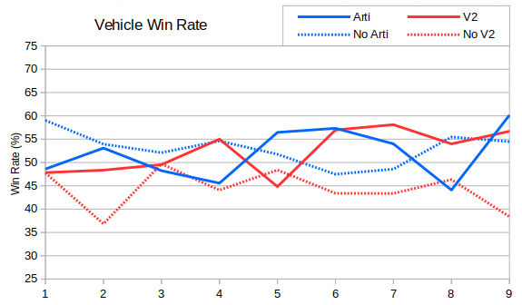

This post we'll look at artilleries and V2s.  As mentioned when discussing the buildings queue there were more radar domes build in earlier seasons.

We can see that the average number of artilleries queued has dropped from over ten per Allied player, down to about one and a half.  V2s have also seen a drop in popularity, but interestingly their use peaked in Season 4, which corresponded with the first season that more players used Soviets than Allies (56% to 44%).  By Season 9 the use of all siege vehicles has converged to 1.4 units per game.

The radar dome unlocks a few more items - the artillery/V2, the helipad/airfield, the spy/thief and the tech center.  Roughly 60-80% of players who build radar domes also go on to build artis and V2s:

Looking at the win rates (and trying to ignore the slight edge for Allies) we can see that Soviets have recently done far better with V2s than without.  Allied players who build artilleries perform roughly as well as those who don't.

