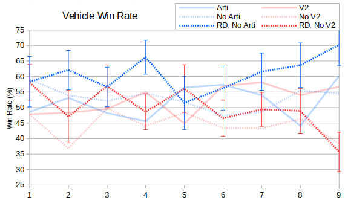
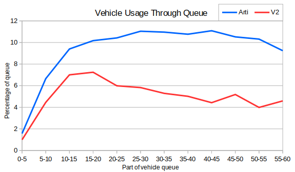

In the last post we looked at the win rate for players who built artis and V2 compared with those players who didn't build them.  I thought it was perhaps fairer to compare players who built the units with players who had the opportunity but chose not to build them.  In this case I've added two lines to show the win rate for players who built Radar Domes but didn't build artilleries or V2s.

We can see there's quite a lot of error in these results - players don't often build Radar Domes without also building artilleries or V2s.  On the whole it looks like Soviet players should always build V2s (since Season 6 at least), while Allied players can do fairly well without artilleries.

I also wanted to know when to start building artilleries and V2s.  As mentioned in a previous post I haven't yet extracted the tick number for each action so instead here I'm using the vehicle count as a proxy.

We can see that V2 production peaks between vehicles 10 and 20, possibly Soviet players start production of tier 3 units at this point.  Meanwhile the graph for artilleries is more drawn out and peaks somewhere between vehicles 25 and 45.  Allies produce mainly medium tanks, which are significantly quicker to build than heavies.  Consequently the x-coordinates of the two lines don't correspond to the same point in games.  In a similar way we can also see that the V2 line becomes erratic after about 40 vehicles. There are not many games where Soviet players produce this many units.  To get a rough estimate I watched a 25 minute Soviet vs Allies match that went to tier three - the Soviet player produced 37 vehicles while the Allied player produced 67.
