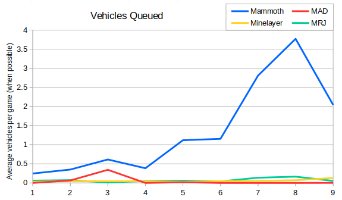
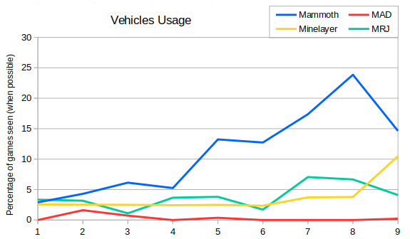
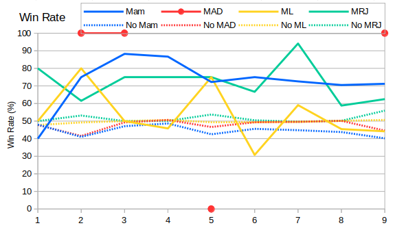

We're about half way through our tour of the vehicles and five of those left start with an M.  I've skipped Mobile Gap Generators in this post, partially because I'm planning to group them with the other faction specials, and partially because they're slightly harder to analyse due to swapping factions in Season 6.  To start here's the averages number of each vehicle queued per season:

So we can immediately see that Mammoth Tanks see far more usage than the other units.  Minelayers and Mobile Radar Jammers are utility units and there's not much value in filling an army with them.  A pack of Mammoths is a much scarier prospect.  Season 8 saw the peak of Mammoth usage, and the effect of the nerf (missile range reduced from 8 to 6.5 cells, vision reduced from 7 to 6 cells) in Season 9 is visible with far fewer Mammoths being queued.

The peak of MAD Tanks in Season 3 is largely due to a single Recruits game between Booby and Ohmk Torque (RAGL-S03-RECRUIT-R11-BOO-OTQ.orarep).  I wasn't able to watch the game but, judging by the spec chat, Omhk Torque had lost basically everything except his MCV when Booby decided to hunt it down by queuing 60 MAD Tanks (along with 125 thieves and 65 migs).  It came with the commentary "play of the season!" by SoScared, so if anyone still has release-20161019 running then they might want to check it out.

We can filter out anomalies like this by looking at the usage graph.  This shows how many games featured each vehicle, ignoring how many of the vehicle were produced.  The "when possible" here refers to players picking an appropriate faction.

Mammoths dominate the graph again, but Minelayers and Radar Jammers aren't far behind this time. In particular we can see that Minelayers had a boost in Season 9, and made an appearance in over 10% of all build queues.  MAD Tanks seem to be in need of some love.

Looking next at win rates for these vehicles then we can see that Mammoths and MRJs correlate fairly well with winning games. These are tier three units, so players who manage to build them are already doing well.  Having said that, the win rate for Tech Centers has been about 65-70% since Season 6, so Mammoths seem good to build and MRJs possibly less so.

The line for Minelayers is all over the place due to the relatively low usage.  As mentioned above, Season 9 saw a Minelayer about 10% of the time, but the stats suggest it's better not to build one.  MAD Tanks have not lost a game since Season 5, so I'm expecting to see lots more  people building them in Season 10.