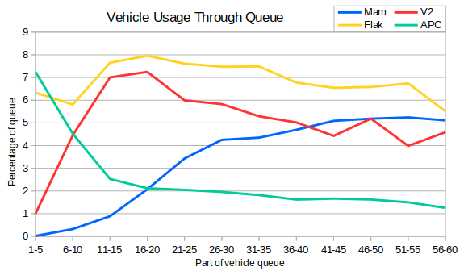

Continuing from last post then I wanted to investigate Mammoths a little more. We looked last time at the average number of Mammoths queued by players "when possible". In the last post this meant "when the player was Soviets" but I wondered about other potential definitions.  Here we have the same "when Soviets" graph, along with the average number of Mammoths by Soviet players who built a tech center, and the average number of Mammoths build by players who built at least one Mammoth.

We can again see that the average number of Mammoths built has increased over the seasons.  Furthermore, in earlier seasons Soviet Tech Centers were often built by players who didn't use Mammoths, but that is much rarely now.

I thought it also might be interesting to see the win rates for Mammoth Tanks compared with Soviet Tech Centers and compared with playing as Soviets.

There were only six games in Season 1 featuring Mammoth Tanks, which explains why the error there is so large.  Between Seasons 3 and 5 it seems clear that Mammoth tanks gave players a significant advantage over just using other Soviet tech. Since Season 6 then the lines for Soviet TC and Mammoths have almost converged. This is partially because it's rare to build a Soviet Tech Center without also building a Mammoth Tank.

Finally I drew a graph of a few of the more popular Soviet vehicles. I've excluded Heavy Tanks because they dwarf the other units.  The graph splits all Soviet vehicle queues into blocks of five, and then calculates the percentage of each block that is made of Mammoths, V2s, Flaks and APCs.

We can see APCs are mainly useful in the early game, and Mammoths are much more likely to appear later on.  V2s are most popular between vehicles 11-20 and gradually fade out when tier 3 comes online. Flaks are useful as an early game unit but more of them are build to counter air and artillery units.