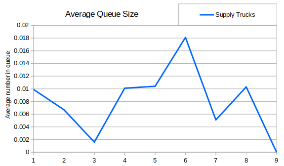
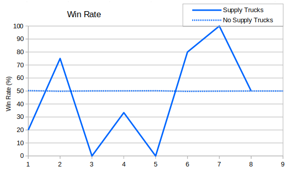
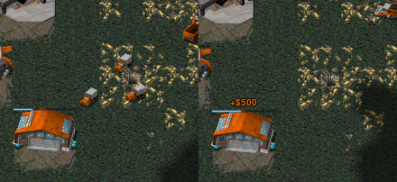

A lesser used vehicle is the supply truck. Still I thought it would be useful to see how much "lesser" it was used.

We can see that there was roughly one supply truck every hundred games, and then in Season 9 they completely fell out of the meta. I looked at the percentage of games they appeared in and the graph was pretty similar. Supply trucks turned up in less than one in a hundred games, since some games contain more than one truck.

There aren't many games represented here, so the margin of error is pretty huge.

After searching through a few replays containing supply trucks then sadly I couldn't find anything particularly amazing. Here's a screenshot of when Punsho built three trucks vs Happy in Season 7 (RAGL-S07-MASTER-GROUP-HAP-PUN-G1.orarep). He then turned them around and converted them back into cash.

In a way Supply Trucks shouldn't a bad unit for tanking. They're very fast and when they die you get a full refund in the form of a crate.  However given that no one seems to have made this strategy work it's probably a bad one.