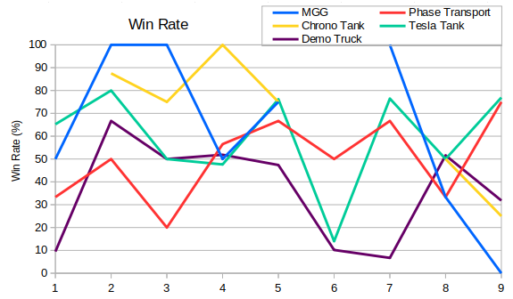

The five remaining vehicles are all faction specific.  The exact factions are a little muddied by the Mobile Gap Generator and Phase Transport swapping between England and France between Seasons 5 and 6.  To start, here are the average number of each vehicle queued per season by players using the corresponding faction.

Tesla Tanks dominate the graph, other than in Seasons 2 and 3 when Chrono Tanks overtake them.  These two vehicles can (to an extent) be spammed. The other three vehicles aren't really useful in packs, they're much better by themselves (phase transport and demo) or with a larger army (MGG).

If we look at the percentage of games they appear in, rather than the quantity used, then we see a more balanced picture.

The Allied units appear in roughly 5% of games, with Phase Transports being the most popular of these. Since about Season 4, the Soviet specials have appeared roughly two-to-three times that many games.

The win rate graph is a little bit all over the place.  For the Allied vehicles in particular there isn't much data. In some seasons then Chrono Tanks and/or Mobile Gap Generators didn't even feature. With the Soviet vehicles then perhaps we have something a bit more meaningful, and it suggests that since Season 4 Tesla Tanks have been good to build, whereas Demo Trucks have been a bit of a liability.  Sometimes Demos are used to instantly wipe the opponent's army, but sometimes they're blown up before leaving the base. Perhaps this is what is being shown by the purple line.
