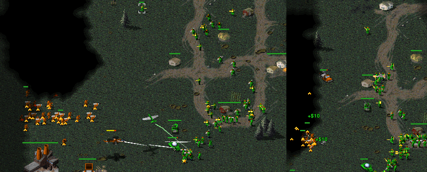
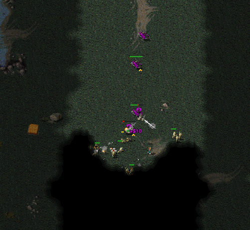
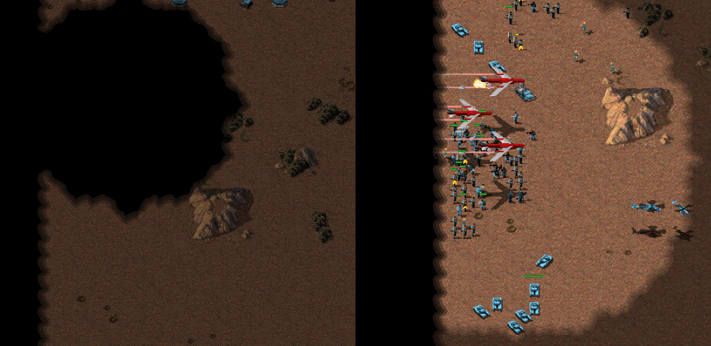

One of the lesser used faction-specific vehicles is the Mobile Gap Generator.  I thought it might be interesting to have a look for ways it has been used in recent games.  Here's a list of all the games I could find featuring MGGs, along with the player who built them, the map name and the number of MGGs built:

```
RAGL-S01-MINION-R03-JAY-ANT.orarep,Jayman,Winter Storm,2
RAGL-S01-RECRUIT-R08-GOH-DAZ..orarep,Dazultra,Tournament Island,2
RAGL-S01-MINION-R02-JAY-TRX.orarep,Jayman,Dual Cold Front,2
RAGL-S01-MINION-R01-FAR-TRX.orarep,Fahrrad,Tournament Island,2
RAGL-S01-MASTER-R03-FIV-GAT.orarep,FiveAces,Behind The Veil,1
RAGL-S01-MASTER-R09-FIV-MTR.orarep,FiveAces,Sidestep,1
RAGL-S01-MINION-R11-FAR-JAY.orarep,Jayman,Behind The Veil,2
RAGL-S01-MASTER-R02-FIV-ZOI.orarep,FiveAces,Forest Path,1

RAGL-S02-MASTER-R02-FIV-HMB.orarep,FiveAces,Dual Cold Front [RAGL, S02],1
RAGL-S02-MASTER-R01-FIV-ANJ.orarep,FiveAces,Desert Rats [RAGL, S02],1
RAGL-S02-MINION-R03-HAN-FRE.orarep,FRenzy,Tournament Island,4
RAGL-S02-MINION-R08-FRE-SXX.orarep,FRenzy,Winter Storm,1
RAGL-S02-MINION-R04-JAY-SXX.orarep,Jayman,Desert Rats [RAGL, S02],3

RAGL-S03-RECRUIT-R09-WCS-OTQ.orarep,WhoCares!?,Pitfight (RAGL:S3),1
RAGL-S03-MASTER-R01-FIV-ABC.orarep,FiveAces,Winter Storm 2 (RAGL:S3),2
RAGL-S03-MASTER-R03-FIV-FAR.orarep,FiveAces,Winter Storm 2 (RAGL:S3),1

RAGL-S04-RECRUIT-R02-MAN-SCR.orarep,manu200,Winter Storm 2 (RAGL:S4),1
RAGL-S04-RECRUITS-POTH-WRK-KZU-5.orarep,kazu.,Sidestep (RAGL:S4),1

RAGL-S05-MINIONS-R1-esk-MCV-G1.orarep,eskimo,Badger Hills (RAGL:S5),1
RAGL-S05-MINIONS-R08-SOT-ESK-G2.orarep,eskimo,Pitfight (RAGL:S5),3
RAGL-S05-MASTER-R05-FIV-ANJ.orarep,FiveAces,Stanitsa (RAGL:S5),2
RAGL-S05-RECRUITA-R03-BUG-JUR-G1.orarep,b�g,Stanitsa (RAGL:S5),1

RAGL-S07-MINIONSB-GROUP-AMO-MTL-G2.orarep,Metalcallous,Forgotten Plains (RAGL:S7),3
RAGL-S07-MASTER-GROUP-FIV-ORB-G2.orarep,Orb,Forgotten Plains (RAGL:S7),1
RAGL-S07-MINIONB-GROUP-AMO-MTL-G2.orarep,Metalcallous,Forgotten Plains (RAGL:S7),3
RAGL-S07-MINIONSB-GROUP-DTR-MTL-G1.orarep,Metalcallous,Pitfight (RAGL:S7),2

RAGL-S08-MASTER-POSF-ORB-FIV-G2.orarep,Mr. Shady,Enhanced Snakes and Ladders (RAGL:S8),2
RAGL-S08-MASTER-GROUP-ORB-PUN-G2.orarep,PunPun,Marigold Town (RAGL:S8),1
RAGL-S08-MASTER-GROUP-UPS-BBB-G2.orarep,Mr Bain,River Crossing 2 (RAGL:S8),1

RAGL-S09-MINION-GROUP-HAN-PIE-G2.orarep,PieChild,Ore Egano RAGL S9,2
```

Something to notice here is that FiveAces is the king of the MGGs.  He's queued ten MGGs across eight games in four seasons of RAGL.

I watched all the games from Seasons 8 and 9, and have made some notes of how MGGs were used.

# Orb vs FiveAces (Season 8: RAGL-S08-MASTER-POSF-ORB-FIV-G2.orarep)
Stream from JackoDerp (game 2 starts at 31 minutes): https://www.twitch.tv/videos/516095285

Second half of stream with other games in series: https://www.twitch.tv/videos/516096116

This was a semi-final match where Orb built two MGGs. The first was perhaps used as a decoy and didn't achieve much. The second lasted much longer although again Orb initially used it to shroud a few technicians and some base defences.  This might have discouraged FiveAces from sending migs into the area, but an AA gun or radar jammer would have been more effective.  Possibly the main benefit was protecting Orb's hinds from flaks.  This was a really exciting series and well worth a watch.

# Punsho vs Orb (Season 8: RAGL-S08-MASTER-GROUP-ORB-PUN-G2.orarep)
FiveAces Shoutcast (game 2 starts at 17 minutes): https://www.youtube.com/watch?v=rtL1Bv1Nxmc

Another great matchup from Season 8. This time Orb is on the receiving end when Punsho breaks out an MGG.  Unfortunately the MGG starts off out of position, and even once it's in the right place it doesn't have any impact against Orb's tesla troopers (gap generation doesn't reduce infantry vision).



# Bain vs Upps (Season 8: RAGL-S08-MASTER-GROUP-UPS-BBB-G2.orarep)

In this game Bain builds an MGG and a radar jammer to defend some infantry including Tanya. It kind of acts as a reverse GPS, allowing Upps to determine where to dive to try to snipe Tanya. Ultimately Tanya stays alive much longer than the MGG, but possibly the best defence came from the dense crowd of other infantry rather than the MGG.



# PieChild vs HansNilhall (Season 9: RAGL-S09-MINION-GROUP-HAN-PIE-G2.orarep)
Biomecaman Cast: https://www.youtube.com/watch?v=iwzISVDB7sQ&t=1188s

Season 9 was on release-20200503 and was the first to feature a price reduction of the MGG from 1200 to 1000.  Unfortunately this did not result in an increased number of MGG builds; in fact this was the only game with them.  The game as a whole was brilliant, although again the mobile gap generator didn't exactly shine.  PieChild took the MGG with a large force and went for a flank attack down the side of the map. Hans saw the shroud and guessed it was a good spot to send some parabombs.



Overall MGGs are in an odd spot. They often seem to cause more problems for the owner than their opponent.  One slight benefit is that they can be used as a counter to GPS in the hyper-late game. Rather than seeing individual GPS dots the opponent only gets to see a circle of shroud.  It's a pretty niche purpose, and arguably the standard gap generator is a better solution.

There have been a few suggestions to help improve MGGs, some dating back to 2013:

 * Make gap generator/MGG render fog circle instead of shroud: https://github.com/OpenRA/OpenRA/issues/15364
 * Make MGG leave trail of shroud: https://forum.openra.net/viewtopic.php?p=309985#p309985
 * Ability to toggle MGG shroud: https://github.com/OpenRA/OpenRA/issues/16418
 * Increase vision, reduce cost, reduce build time and give radar jamming ability: https://github.com/OpenRA/OpenRA/issues/2958
