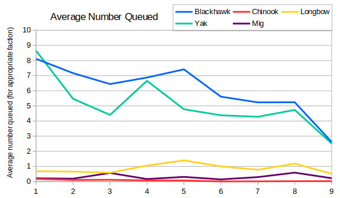
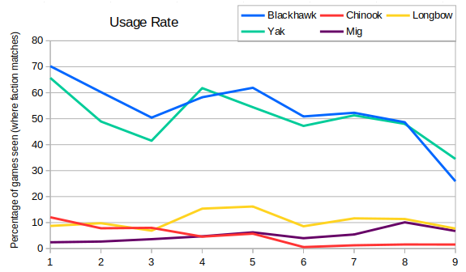
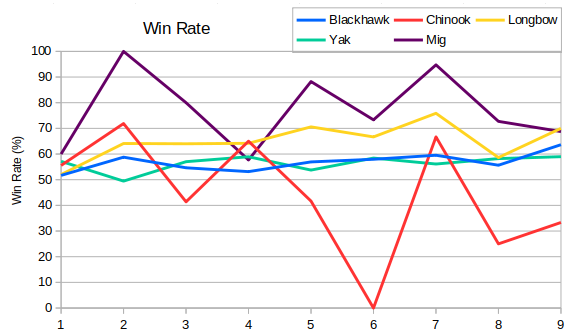

Having looked at all the vehicles, it's time to move onto the next queue.  There are five air units in the game and to start with here are the average number of each queued per game. The figures for each unit are restricted to games where the player was the appropriate faction (i.e. Allies/Soviets) and the blackhawk line includes hinds (for obvious reasons).



Blackhawks and yaks dominate the graph, and their use has noticably dropped over time.  One cause of this is definitely the drop in radar dome usage.  Longbows have been consistently in third place and migs in fourth.  Right at the bottom is the chinook. It's hard to tell, but the line doesn't actually hit zero.



Next up is the usage graph - i.e. the percentage of games that featured each unit.  We see a similar picture to the first graph, but yaks have moved up a bit. This means that yaks are used more often than blackhawks, but when blackhawks are queued then a player will queue more of them.  The chinook line shows a steady decline over the first six seasons, but since then has picked up a little.  Perhaps if we bring back the option for using chinooks as a flying bomb then we'll see a few more of them.

Finally here's the win rate graph.



The line for chinooks is based on pretty low usage, so it's hard to take that very seriously. There's reasonable evidence that migs and longbows increase your chance of winning, and it's possible that migs are better than longbows. It's also possible that players who build migs already have e.g. iron curtains and mammoths, and so the increase in performance might not be caused by the unit.  Comparing the blackhawk and yak lines with the radar dome win rate from an earlier post shows that the subset of players building blackhawks or yaks are roughly 5% more likely to win than the set of all players who build a radar dome.  E.g. In Season 9 the win rates were:

```
Built RD  56%
Blackhawk 64%
Yak       59%
```
