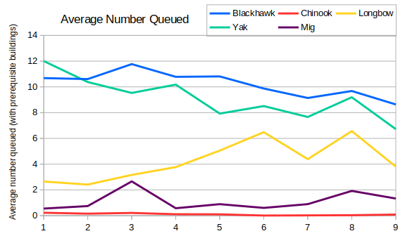
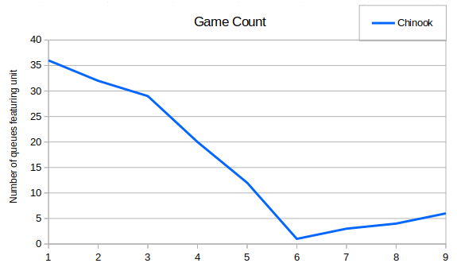
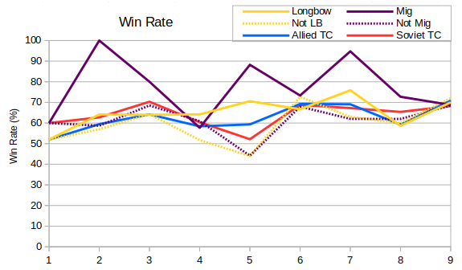

In the last post we saw the decline in air units over time and noted that one cause was the drop in radar dome usage. I thought it would be interesting to look at the average number of each air unit queued when the player has build the prerequisite buildings (i.e. helipad/airfield for blackhawk, yak and chinook, additionally a tech center for longbows and migs).

Obviously the numbers are higher in this graph than the equivalent graph in the last post (maybe two or three times higher).  However the decline in tier two air units over the nine series is still prominant.  Possibly this is due to game lengths being shorter or due to helipads and airfields being built nearer the end of the game.

The flat line for chinooks was bothering me a little, so I decided to plot the raw number of players that used a chinook each season. There were six games in S09 featuring chinooks, and if the pattern continues then we might see as many as ten in S10 (although I wouldn't hold your breath).

Something else we noted last post was that the win rates for T3 aircraft might be caused simply by having access to other T3 tech.  Here is a graph showing the win rates of longbows and migs compared with tech centers.  It also includes dotted lines showing the win rates of tech centers without T3 aircraft.

In most seasons then players building migs outperformed those who build Soviet tech centers but not migs.  There's some error in these results, but it seems reasonable to say migs are a good investment.  Similarly players building longbows generally did a little better than players who built an Allied tech center without a longbow.  The "Allied TC" and "Soviet TC" lines show the overall win rates for players who built those tech centers, regardless of whether they built air units or not. It tracks between the unit/no unit lines for each faction, because it's an average of them.

From the graph then it looks like Season 9 was the most balanced of all seasons for T3 air play. All the win rate lines converge around the 70% mark. However we also have to remember that only about 20% of games featured tier three at all, and less than 10% featured tier three air units.
