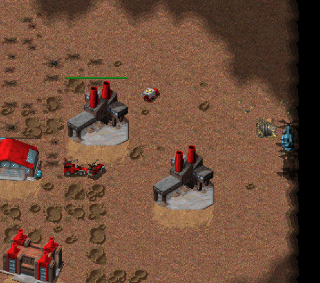
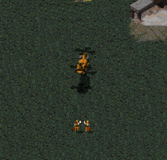
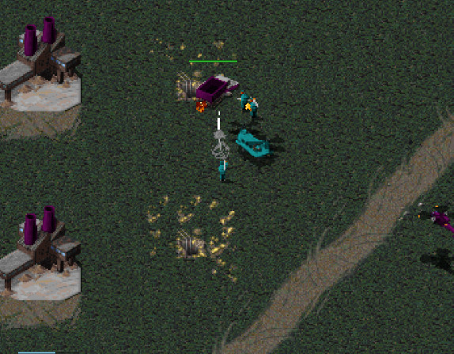

As mentioned chinooks haven't seen a huge amount of love recently.  I wanted to check what great plays there have been with them, so I went through the recent games where they were queued to see how they're being used.

There were a lot of games with chinooks in every season from S01-S05. Skipping over those then here's the full list of games featuring queued chinooks in S06-S09 along with the player, map name and the quantity of chinooks:

```
RAGL-S06-MINION-R04-WCS-MCV-G1.orarep,mechANIC,Forgotten Plains (RAGL:S6),1

RAGL-S07-MINIONB-GROUP-NUK-SIR-G1.orarep,SirCakealot,Pitfight (RAGL:S7),1
RAGL-S07-MINIONB-GROUP-AMO-SIR-G1.orarep,SirCakealot,Shards (RAGL:S7),1
RAGL-S07-MINIONB-GROUP-SQY-SIR-G2.orarep,CakeLotsir,Hourglass (RAGL:S7),1

RAGL-S08-MINIONA-GROUP-BLK-DDC-G2.orarep,Blackened,Blitz (RAGL:S8),1
RAGL-S08-MINIONA-GROUP-SIN-HAN-G2.orarep,HansNilhall,Windige Gasse (RAGL:S8),1
RAGL-S08-MINIONA-GROUP-ZOF-SIN-G2.orarep,SinJul,Forgotten Plains (RAGL:S8),1
RAGL-S08-MINION-POF-BLK-GOA-G2.orarep,Blackened,Marigold Town (RAGL:S8),2

RAGL-S09-MINION-GROUP-HAN-PIE-G2.orarep,PieChild,Ore Egano RAGL S9,1
RAGL-S09-MINION-GROUP-IOT-KSK-G1.orarep,KSK_Nico,The Swamp RAGL S9,1
RAGL-S09-MINION-GROUP-GOR-SIN-G1.orarep,SinJul,Ore Egano RAGL S9,5
RAGL-S09-MASTER-GROUP-FIV-JKD-G1.orarep,FiveAces,The Swamp RAGL S9,1
RAGL-S09-MASTER-GROUP-PLAYOFF-MRK-ILM-G1.orarep,morkel,Discovery RAGL S9,1
RAGL-S09-MASTER-GROUP-PLAYOFF-MRK-GOA-G1.orarep,morkel,Wetlands RAGL S9,1
```

I watched all the Season 9 games and found that in half of the games then the chinook didn't actually hit the field. In several others then the chinook didn't have much of an impact. Here's an overview of all the chinooks from Season 9:

# PieChild vs Hans Nilhall (Season 9: RAGL-S09-MINION-GROUP-HAN-PIE-G2.orarep)
Biomecaman Cast: https://www.youtube.com/watch?v=iwzISVDB7sQ&t=1188s

PieChild loads Tanya into a chinook, flies it to the Hans' backlines, but Hans manages to shoot it down before it can land.



This is where Hans spotted the chinook and chased it down with flaks. I've recommended this game before, but it's worth recommending again. (PS Yes that's right - Hans had a demo truck casually laying around his base)

# Morkel vs Goat (Season 9: RAGL-S09-MASTER-GROUP-PLAYOFF-MRK-GOA-G1.orarep)
Kaution Cast: https://www.youtube.com/watch?v=vDSzvZMkg-8

FiveAces Cast: https://www.youtube.com/watch?v=XSC0qchYuX0



Morkel produces two engis and a chinook and loads them up. It looks like the start of a really interesting play, but with Goat attacking on two fronts then Morkel ends up trying to land the engis next to one of the aggressive forces and it gets shot down. This was the first game in the season final, and so I guess the pressure must have been insane.

# FiveAces vs Jacko Derp (Season 9: RAGL-S09-MASTER-GROUP-FIV-JKD-G1.orarep)

FiveAces produces a chinook, loads up three rockets and drops them in the backlines for some harassment. Unfortunately (for supporters of chinooks) Jacko spots this immediately and cleans them up with a hind.



FiveAces preserves the chinook for quite a bit longer, even using it to tank rocket fire and then patching it up at one point, but the only other use it gets is for vision.  Having said all this, this match was a good one, and since the rockets did some damage then I'm awarding FiveAces the chinook play-of-the-season award for Season 9.
