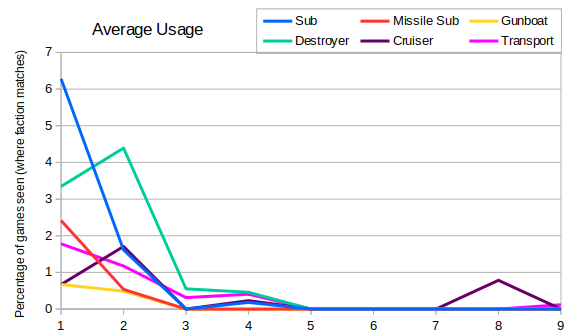
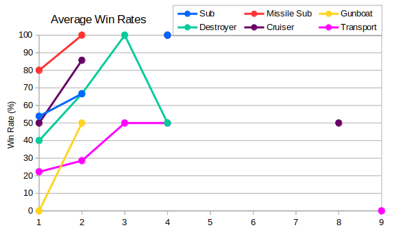

The final queue is the naval queue.  Due to the nature of many competitive maps, naval units are often impossible to build.  There's not a huge amount of difference between the graphs for average queue size and average unit usage, so I'll just include the latter:



There were no naval units for the whole of Seasons 5, 6 and 7.  Furthermore there was only one game in each of Seasons 8 and 9 that featured naval units.  Earlier seasons had more maps that encouraged naval play as we'll see later on.



Having a quick look at the average win rate for each unit we can see that during Seasons 1 and 2 Missile Subs had the best win rate, probably followed by cruisers. Naval transports were probably the least successful unit.  All of these results are only based on 30-40 games though, so it wouldn't be fair to use this to conclude that e.g. Soviets have the upper hand in naval battles.

I was interested to see which maps most often featured naval play, and the results were:

```
Bloody Delta (S01): 3/4 games (75.00%)
Singles (S01,S02): 38/60 games (63.33%)
Tournament Island (S01,S02): 8/32 games (25.00%)
Winter Storm 2 (S03/S04): 6/70 games (8.57%)
Blitz (S08): 2/30 games (6.67%)
Siberian Summer (S04): 1/16 games (6.25%)
Crossfire (S02): 1/16 games (6.25%)
Dual Cold Front (S01,S02,S04,S09): 7/208 games (3.37%)
Teared Strait (S09): 1/32 games (3.12%)
Sidestep (S01,S02,S04): 6/212 games (2.83%)
Ysmir (S04): 2/90 games (2.22%)
```
