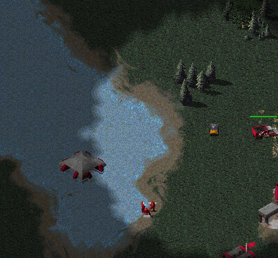
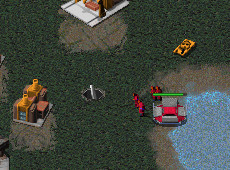
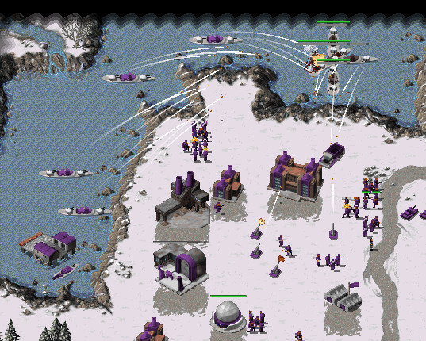

To conclude this section on naval units I thought it would be interesting to see how they've been used recently.  There are only two games from the past five seasons featuring naval, so I watched both.

First up is Mo vs Morkel in Season 9 (RAGL-S09-MASTER-GROUP-AMO-MRK-G2.orarep.orarep) on Teared Strait (created by Mo, and affectionately known as "the Mo map").  Mo built a subpen fairly early and set up a gren drop.  At the same time he started preparing a rocket drop too.  Unfortunately the rocket drop was scouted and cleaned up fairly quickly by Morkel's ranger:

At the other end of the strait the grens unloaded, were spotted by a medium tank and, since Morkel had a pillbox prepared, they were ineffective.

Both naval transports lasted a fair while longer, and got a small amount of use for scouting. However it's probably fair to say that naval didn't help Mo much in this game.

The second game is Blackened vs DoDoCat on Blitz in Season 8 (RAGL-S08-MINIONA-GROUP-BLK-DDC-G2.orarep).  The game is unconventional in many ways, but notably here because both players build naval yards and cruisers.  DoDoCat also built a gunboat.  By 11 minutes Blackened was 26 medium tanks and 5 hinds ahead, and earning about three times as much.  By 15 minutes Blackened had got to seven naval yards and was producing cruisers (and also had a flock of unused longbows).

At 17 minutes the time had come, and Blackened chronoshifted five cruisers into the backlines:

The cruisers killed a con yard and an advanced power plant, but the game was really already decided.

DoDoCat really summed up the game before it even started by saying he played "just for fun" and it was a fun game. Later on Blackened chinook dropped Tanya then C4ed the tech center. As Tanya went further in towards DoDoCat's base then friendly fire from the cruisers took down another power plant.  Blackened chronoed cruisers again later to take out the missile silo.

So this was technically one win and one loss for naval play, but probably more accurately it was a victory for entertaining the players.

With this post we have finished the tour of the buildings and units from RAGL Seasons 1-9. Season 10 is due to start on Monday* with some updated balance changes and I'm looking forward to seeing what it does to the graphs!

\* Sign up here: https://forum.openra.net/viewtopic.php?f=85&t=21299
